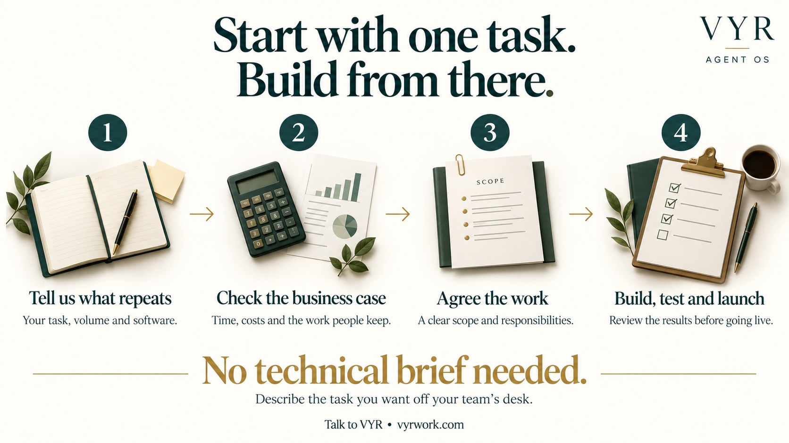

[← VYR Agent OS](README.md)

# Tell us the task. We will discuss the right next step.

**You do not need an AI strategy document to start.** If your team repeats a task every day or week, VYR can assess whether it is a useful candidate for automation.

**[Help me find a useful first workflow →](https://vyrwork.com/contact?utm_source=github&utm_medium=referral&utm_campaign=agent_os_workflows&utm_content=buyers_guide_top)** · [Describe my task on WhatsApp](https://wa.me/6598176520?text=Hi+VYR%2C+I+found+your+workflow+showcase+on+GitHub.+The+task+my+team+repeats+is+__.+My+business+is+__.+We+handle+about+__+tasks+per+month%2C+using+__.+I+would+like+to+discuss+whether+AI+could+save+us+time+or+money.)

## A good first message takes four details

> We run a ___ business. We handle about ___ enquiries, invoices or cases each month. We use ___. Our team spends too much time on ___.

An estimate is enough to start the discussion. You can also mention the decisions that must stay with your team. Please keep customer records, passwords and other confidential details out of public GitHub issues.

**[Send VYR my business problem →](https://vyrwork.com/contact?utm_source=github&utm_medium=referral&utm_campaign=agent_os_workflows&utm_content=buyers_guide_brief)**

## What happens after an enquiry?

VYR reviews the process, the software involved and what a useful result would look like. The next step may be a demonstration, a more detailed discovery conversation or a written project scope, depending on the task. Any discovery fees, build scope and delivery timing should be confirmed before proceeding.

The contact page states a target reply within one Singapore business day. [Contact options and booking information](https://vyrwork.com/contact?utm_source=github&utm_medium=referral&utm_campaign=agent_os_workflows&utm_content=buyers_guide_response).

## Questions business owners ask

### Will this work with the software we already use?

VYR checks that during the first assessment. Some systems offer straightforward connections; others need access, data cleanup or a different approach. Share the names of your tools so compatibility can be assessed before the build is agreed.

### Do I need to replace my whole team or system?

Start with a repeatable task. The business decides how to use the time released: more customer capacity, less paid overtime or an avoided hire. Removing a whole role requires enough suitable work to be removed and the remaining duties to be covered. [See the staffing and savings examples](ROI.md).

### How is this different from asking a chatbot a question?

A chatbot conversation can help with an answer or a draft. An agreed business workflow coordinates several steps: receive a request, check relevant information, prepare the result and pass it to the right person or permitted next action. The value is in how those steps fit your process.

### What if the AI is unsure or a customer asks something sensitive?

The workflow should send uncertain or sensitive cases to a named person with the relevant details. You agree the rules. The examples show where finance, customer service, recruiters and other staff keep decisions.

### What happens to our data?

Before a build, agree which records the workflow can access, which providers process them, who can see the output, and the retention and access requirements. These depend on your systems and the agreed implementation. A workflow example is not a compliance certification.

### What should I budget?

Published pricing starts at **S$2,000 for one workflow**. The first three months of Agent Care are included, then care starts at **S$150/month**. AI usage is charged separately by the provider. Other software, data preparation or extra scope can affect the cost. [Current packages](https://vyrwork.com/pricing?utm_source=github&utm_medium=referral&utm_campaign=agent_os_workflows&utm_content=buyers_guide_pricing).

### How will we know it is worth the investment?

Agree a baseline before the build: task volume, time per task, errors or rework, and costs you could avoid. Compare those with the time still needed for human review and the actual ongoing costs. [Our worked examples](ROI.md) show both potential savings and what happens when no payroll cost comes out.

**[Discuss whether the numbers make sense for us →](https://vyrwork.com/contact?utm_source=github&utm_medium=referral&utm_campaign=agent_os_workflows&utm_content=buyers_guide_roi)** · [Ask VYR a buying question](https://wa.me/6598176520?text=Hi+VYR%2C+I+found+your+buyer+guide+page+through+GitHub.+My+business+is+__.+We+handle+about+__+tasks+per+month%2C+using+__.+I+would+like+to+discuss+whether+AI+could+save+us+time+or+money.)

## See something relevant before you decide

- [Browse 14 business examples](docs/workflows/README.md): find a task similar to yours.
- [Explore the receptionist demo](docs/workflows/ai-receptionist.md): understand the caller experience using sample data.
- [Meet Dexter Ng](MEET_DEXTER.md): review the professional background behind VYR's CTO.
- [Check service status and sources](docs/workflows/SOURCES.md): see which examples operate inside VYR, which are demos and which need a custom build.

## Your first task does not need to match an example exactly

Bring the bottleneck. VYR will assess whether an existing design is a useful starting point and what your business needs to change.

**[Let’s discuss the task you want off your desk →](https://vyrwork.com/contact?utm_source=github&utm_medium=referral&utm_campaign=agent_os_workflows&utm_content=buyers_guide_bottom)** · [WhatsApp VYR](https://wa.me/6598176520?text=Hi+VYR%2C+I+found+your+workflow+showcase+on+GitHub.+The+task+my+team+repeats+is+__.+My+business+is+__.+We+handle+about+__+tasks+per+month%2C+using+__.+I+would+like+to+discuss+whether+AI+could+save+us+time+or+money.)
