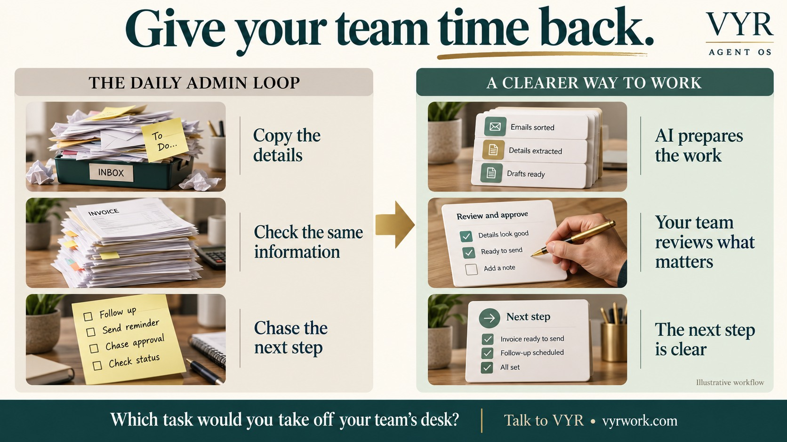

# Less repetitive work. More room to grow.

**Your team should be helping customers, closing business and solving problems—not spending the day copying, checking and chasing.**

VYR builds **AI assistants that work together** to handle repeatable business tasks: answering routine enquiries, preparing invoices, organising sales research and getting the next step ready. Your people keep the important decisions.

Start with one task. Find out what it could save before committing to a bigger project.

**[Find my best automation opportunity →](https://vyrwork.com/contact?utm_source=github&utm_medium=referral&utm_campaign=agent_os_workflows&utm_content=readme_primary)** · [Tell us your task on WhatsApp](https://wa.me/6598176520?text=Hi+VYR%2C+I+found+your+workflow+showcase+on+GitHub.+The+task+my+team+repeats+is+__.+My+business+is+__.+We+handle+about+__+tasks+per+month%2C+using+__.+I+would+like+to+discuss+whether+AI+could+save+us+time+or+money.)

**Singapore-based VYR PTE. LTD.** · [Meet Dexter Ng, CTO](MEET_DEXTER.md) · [Published packages from S$2,000](https://vyrwork.com/pricing?utm_source=github&utm_medium=referral&utm_campaign=agent_os_workflows&utm_content=readme_top_pricing)

[Explore 14 business examples](docs/workflows/README.md) · [See the savings examples](ROI.md) · [How to get started](BUYERS_GUIDE.md)

## Does your business recognise this day?

An enquiry arrives. Someone checks a calendar. Another person copies details into a spreadsheet. An invoice needs checking. A follow-up waits because everybody is busy.

**The cost is more than the task itself. It is the interruption, the repeated checking and the work still waiting behind it.**

An agreed AI workflow can prepare that routine work and bring the unusual cases to your team with the details attached. The opportunity is to reduce paid admin work, avoid adding capacity too soon, or help the same team serve more customers.

**[Show VYR the task your team keeps repeating →](https://vyrwork.com/contact?utm_source=github&utm_medium=referral&utm_campaign=agent_os_workflows&utm_content=readme_problem)** · [Start with a short WhatsApp message](https://wa.me/6598176520?text=Hi+VYR%2C+I+found+your+workflow+showcase+on+GitHub.+The+task+my+team+repeats+is+__.+My+business+is+__.+We+handle+about+__+tasks+per+month%2C+using+__.+I+would+like+to+discuss+whether+AI+could+save+us+time+or+money.)

## What is an AI agent, in plain English?

Think of it as **a software assistant with a specific job**. One reads the request, another checks approved information, and another prepares the next step. A workflow is simply the sequence they follow together.

For example, an invoice arrives: one assistant reads it, another checks the details, and another prepares a draft for finance to review. You agree what the system may do and when a person must take over.

**You do not need to learn AI terminology or design the system yourself. Bring the business problem. VYR assesses the fit and agrees the work with you.**

**[Could this work with my current process? →](https://vyrwork.com/contact?utm_source=github&utm_medium=referral&utm_campaign=agent_os_workflows&utm_content=readme_how)**

## Start where repetitive work is costing you attention

| Your business problem | What the AI workflow helps prepare | Example and readiness |
|---|---|---|
| Calls and booking questions interrupt your front desk | Routine answers, available options and a clear staff handover | [AI Receptionist](docs/workflows/ai-receptionist.md) · Demo with sample data |
| Finance keeps retyping and comparing invoices | Checked details, flagged differences and an accounting draft | [Invoice Processing](docs/workflows/invoice-processing.md) · Custom build |
| Sales spends too much time researching companies | An organised prospect spreadsheet for your team to review | [Prospect Research](docs/workflows/lead-generation.md) · Used inside VYR |
| Customer messages bounce between inboxes | A prepared reply or the right staff member with the context | [Customer Support](docs/workflows/customer-support.md) · Custom build |
| Follow-ups and onboarding depend on reminders | A proposed next action and a clearer record of what is outstanding | [Sales Follow-up](docs/workflows/lead-nurture.md) · [Employee Onboarding](docs/workflows/hr-operations.md) · Custom builds |

More examples for [clinics](docs/workflows/clinics.md), [beauty and wellness](docs/workflows/beauty-and-wellness.md), [tuition centres](docs/workflows/tuition-centres.md), [food businesses](docs/workflows/food-and-beverage.md), [recruitment](docs/workflows/recruitment-screening.md), [content](docs/workflows/content-operations.md), [social media](docs/workflows/social-command-center.md) and [review preparation](docs/workflows/compliance-evidence.md).

**[Help me choose the right first task →](https://vyrwork.com/contact?utm_source=github&utm_medium=referral&utm_campaign=agent_os_workflows&utm_content=readme_choose)** · [Compare all 14 workflows](docs/workflows/README.md)

## See how a receptionist assistant handles an enquiry

**A caller asks. The system checks the approved information. It answers a routine question or helps with a sample booking. Staff take the sensitive or unsupported requests.**

This is a working **DEMO using sample data**, with no live booking connection. The [full example](docs/workflows/ai-receptionist.md) explains both the routine-answer and booking paths.

**[Ask VYR for a receptionist demonstration →](https://vyrwork.com/contact?utm_source=github&utm_medium=referral&utm_campaign=agent_os_workflows&utm_content=readme_receptionist)** · [Discuss my booking enquiries](https://wa.me/6598176520?text=Hi+VYR%2C+I+found+your+AI+Receptionist+page+through+GitHub.+My+business+is+__.+We+handle+about+__+tasks+per+month%2C+using+__.+I+would+like+to+discuss+whether+AI+could+save+us+time+or+money.)

## Could it save enough to be worth doing?

**Start with hours. Then check whether those hours can reduce a real cost.**

| Illustrative example | Time released each month | Equivalent 8-hour working days | Net monthly cash benefit from month 4 |
|---|---:|---:|---:|
| Invoice administration | 40 hours | 5 days | S$375 |
| Booking enquiries | 80 hours | 10 days | S$950 |
| Routine support | 160 hours | 20 days | S$2,050 |

These are **examples, not client results**. Each assumes S$30 per staff-hour, subtracts remaining human review, and assumes half the released time becomes an avoidable paid cost. Running costs are included. [See the inputs, annual return, setup recovery and the no-payroll-saving case](ROI.md).

The 160-hour example is one full-time equivalent of task capacity, using **160 hours/month**. Removing a complete role depends on all its duties and service coverage. Savings may come from less overtime, fewer contractor hours or avoiding a hire or backfill. If payroll stays unchanged, the benefit is extra capacity.

**[Discuss the numbers for my business →](https://vyrwork.com/contact?utm_source=github&utm_medium=referral&utm_campaign=agent_os_workflows&utm_content=readme_roi)** · [Send VYR my task volume](https://wa.me/6598176520?text=Hi+VYR%2C+I+found+your+savings+page+through+GitHub.+My+business+is+__.+We+handle+about+__+tasks+per+month%2C+using+__.+I+would+like+to+discuss+whether+AI+could+save+us+time+or+money.)

## Know who you are working with

**Dexter Ng is CTO at VYR WORK.** His professional background spans technology leadership, cybersecurity, data protection and business software. His current LinkedIn positioning focuses on AI automation for Singapore businesses, with people retaining important approvals.

That background brings practical questions into the buying conversation: what systems need to connect, which information is sensitive, and who should approve the result.

You can also review his [HITBSecConf2023 speaker profile](https://conference.hitb.org/hitbsecconf2023hkt/speaker/dexter-ng/) and [2020 data-protection webinar appearance](https://blackstormco.asia/data-protection-officer-requirement-what-you-need-to-know/). These are records of Dexter's professional experience, not endorsements of VYR.

[Meet Dexter and review his background](MEET_DEXTER.md) · **[View Dexter on LinkedIn](https://www.linkedin.com/in/dexterng/)**

**[Discuss your process with VYR →](https://vyrwork.com/contact?utm_source=github&utm_medium=referral&utm_campaign=agent_os_workflows&utm_content=readme_credibility)**

## Clear examples. Clear status.

| Official label | What it means for you |
|---|---|
| **LIVE — used inside VYR** | Three workflows: content preparation, prospect research and social oversight. Content generation is paused pending approvals; prospect research sends no outreach; the social console is read-only, with a separate approved publishing path. |
| **DEMO — try it with sample data** | The voice receptionist shows the experience using sample information and calendars. |
| **BUILT FOR YOU — a custom implementation** | Ten designs are starting points for a build agreed around your business. They are not claimed client deployments. |

Source status was checked on **27 September 2026**. [Review the official workflow sources](docs/workflows/SOURCES.md).

**[Ask what is ready for my business →](https://vyrwork.com/contact?utm_source=github&utm_medium=referral&utm_campaign=agent_os_workflows&utm_content=readme_readiness)**

## Start with one process, not a company-wide overhaul

1. **Tell us what repeats.** The task, your software and roughly how often it happens.
2. **Check the business case.** Time used today, review needed afterwards and costs you could actually avoid.
3. **Agree the work.** The connections, responsibilities, price and definition of a useful result.
4. **Build, test and launch.** Review the workflow and its exceptions before it goes live.

Published packages start at **S$2,000 for one workflow**, including the first three months of Agent Care. Ongoing care starts at **S$150/month from month four**; AI usage is charged separately by the provider. Actual scope and terms are confirmed in VYR's proposal. [View current pricing](https://vyrwork.com/pricing?utm_source=github&utm_medium=referral&utm_campaign=agent_os_workflows&utm_content=readme_offer).

**No technical brief needed.** A useful first message is: “We handle about ___ each month, using ___. The part taking the most time is ___.”

**[Find out what AI could take off my team’s desk →](https://vyrwork.com/contact?utm_source=github&utm_medium=referral&utm_campaign=agent_os_workflows&utm_content=readme_bottom)** · [Start the conversation on WhatsApp](https://wa.me/6598176520?text=Hi+VYR%2C+I+found+your+workflow+showcase+on+GitHub.+The+task+my+team+repeats+is+__.+My+business+is+__.+We+handle+about+__+tasks+per+month%2C+using+__.+I+would+like+to+discuss+whether+AI+could+save+us+time+or+money.)

[What happens after I enquire?](BUYERS_GUIDE.md) · [Common buying questions](BUYERS_GUIDE.md#questions-business-owners-ask) · [Dexter's LinkedIn](https://www.linkedin.com/in/dexterng/)

---

**VYR PTE. LTD. · Singapore · UEN 202610859G**

[Official Agent OS page](https://vyrwork.com/agent-os?utm_source=github&utm_medium=referral&utm_campaign=agent_os_workflows&utm_content=readme_footer) · [Contact VYR](https://vyrwork.com/contact?utm_source=github&utm_medium=referral&utm_campaign=agent_os_workflows&utm_content=readme_footer) · [Company information](https://vyrwork.com/about) · [Sources](docs/workflows/SOURCES.md)

Workflow examples explain service scope. Savings depend on the measured process and agreed implementation.
