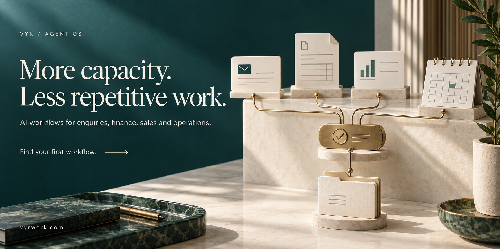
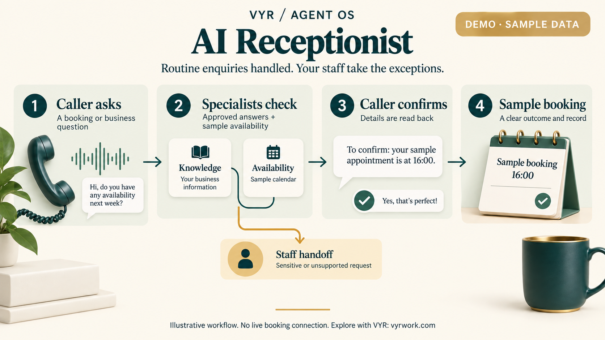

# AI workflows for the work your team keeps repeating

**VYR scopes, builds and manages business automation for Singapore operations teams.** Explore 14 workflow examples for enquiries, finance, sales, support and people operations. Start with one recurring bottleneck and a clear result.

### Have a process in mind?

**[Discuss your workflow with VYR →](https://vyrwork.com/contact?utm_source=github&utm_medium=referral&utm_campaign=agent_os_workflows&utm_content=readme_primary)** · [See the savings examples](ROI.md) · [Explore the workflows](docs/workflows/README.md)

Tell us the process, the systems involved and what your team still needs to approve. The [VYR contact page](https://vyrwork.com/contact?utm_source=github&utm_medium=referral&utm_campaign=agent_os_workflows&utm_content=readme_response) states a target reply within one Singapore business day.

## Handle more work before adding more admin

An AI workflow coordinates repeated tasks across the information and tools your team already uses. Specialist agents prepare the work, check the supporting information and pass exceptions to the right person.

- **Reduce paid admin hours** where automation can remove work currently covered by overtime or contractors.
- **Avoid a hire or backfill** when the released work is large enough and the remaining duties are covered.
- **Give the same team more capacity** for customers, sales conversations and exceptions that need judgment.

Whether this reduces employee headcount depends on whole-role responsibilities and service coverage. Time saved becomes payroll savings only when a paid cost is actually avoided.

## What could the numbers look like?

**Illustrative single-workflow scenarios, not client results.** Each assumes S$30 per staff-hour and 50% of released capacity becomes avoidable paid cost.

| Example | Hours released / month | Equivalent task capacity | Net cash benefit / month from month 4 |
|---|---:|---:|---:|
| Invoice administration | 40 | 0.25 FTE | S$375 |
| Booking enquiries | 80 | 0.50 FTE | S$950 |
| Routine support | 160 | 1.00 FTE | S$2,050 |

The examples subtract human review time and assumed running costs. FTE uses 160 hours/month and does not mean a complete role can be removed. [See every input, annual ROI, payback and the zero-payroll-savings case →](ROI.md)

**[Ask VYR to assess your workflow's business case →](https://vyrwork.com/contact?utm_source=github&utm_medium=referral&utm_campaign=agent_os_workflows&utm_content=readme_roi)**

## See how the work moves

<table>
<tr>
<td width="33%"> <strong>AI Receptionist</strong> Demo · sample data <a href="docs/workflows/ai-receptionist.md">Explore booking enquiries →</a></td>
<td width="33%"> <strong>Invoice Processing</strong> Built for you · not deployed <a href="docs/workflows/invoice-processing.md">Explore invoice administration →</a></td>
<td width="33%"> <strong>Prospect Research</strong> Live · VYR's own operations <a href="docs/workflows/lead-generation.md">Explore sales research →</a></td>
</tr>
</table>

## Find the closest business problem

| Where work gets stuck | Explore the service example |
|---|---|
| Repeated calls, booking questions and calendar checks | [AI Receptionist](docs/workflows/ai-receptionist.md) · [Clinic Front Desk](docs/workflows/clinics.md) · [Beauty & Wellness](docs/workflows/beauty-and-wellness.md) |
| Parent enquiries and trial-class coordination | [Tuition Trial Booking](docs/workflows/tuition-centres.md) |
| Invoice reconciliation and repeated supplier ordering | [Invoice Processing](docs/workflows/invoice-processing.md) · [F&B Supplier Reorder](docs/workflows/food-and-beverage.md) |
| Prospect research and missed deal follow-ups | [Lead Generation](docs/workflows/lead-generation.md) · [Lead Nurture](docs/workflows/lead-nurture.md) |
| Content preparation and social release oversight | [Content Operations](docs/workflows/content-operations.md) · [Social Command Center](docs/workflows/social-command-center.md) |
| Support messages moving between queues | [Customer Support](docs/workflows/customer-support.md) |
| Onboarding coordination and application review | [HR Operations](docs/workflows/hr-operations.md) · [Recruitment Screening](docs/workflows/recruitment-screening.md) |
| Evidence scattered across systems | [Compliance Evidence](docs/workflows/compliance-evidence.md) |

## See the status before you enquire

**3 live workflows · 1 working demo · 10 built-to-order designs.** These are the labels published on [VYR Agent OS](https://vyrwork.com/agent-os?utm_source=github&utm_medium=referral&utm_campaign=agent_os_workflows&utm_content=readme_status) and checked on **27 September 2026**.

| Status | What you can evaluate |
|---|---|
| **LIVE — VYR's own operations** | Content Operations, Lead Generation and Social Command Center. Content generation is currently paused behind its approval backlog. Prospect research ends at a reviewed list. The social console is read-only; a separate publisher handles approved writes. |
| **DEMO — sample data** | A multilingual Voice Receptionist using sample information and calendars. It is not connected to a live client booking system. |
| **BUILT FOR YOU — designed, not deployed** | Ten workflow blueprints scoped and integrated for your business. These are not claimed client deployments or case-study results. |

Every example shows the business goal, how specialist roles work together and where your team retains the decision. [Browse all 14 workflows →](docs/workflows/README.md)

## What working with VYR looks like

1. **Describe one bottleneck.** Bring the current steps, software and recurring exceptions.
2. **Agree the scope.** VYR confirms inputs, integrations, approvals and what completion should look like.
3. **Build and validate the workflow.** Review the proposed behaviour and exceptions before release.
4. **Operate with an owner.** Agree monitoring, support and review responsibilities.

See the [delivery process](https://vyrwork.com/how-it-works?utm_source=github&utm_medium=referral&utm_campaign=agent_os_workflows&utm_content=readme_process) and [buyer guide](BUYERS_GUIDE.md). VYR assesses the systems involved before confirming compatibility or delivery timing.

## Start with one process

Published Agent OS packages start at **S$2,000 for one workflow**. The first three months of Agent Care are included; ongoing care starts at **S$150/month from month four**, and model inference is billed separately by the provider. Scope and current terms are confirmed in VYR's proposal. [Check current pricing](https://vyrwork.com/pricing?utm_source=github&utm_medium=referral&utm_campaign=agent_os_workflows&utm_content=readme_offer)

**[Request a workflow scoping conversation →](https://vyrwork.com/contact?utm_source=github&utm_medium=referral&utm_campaign=agent_os_workflows&utm_content=readme_bottom)**

Or [WhatsApp VYR](https://wa.me/6598176520?text=Hi%20VYR%2C%20I%20found%20your%20Agent%20OS%20workflow%20showcase%20on%20GitHub.%20I%20would%20like%20to%20discuss%20automating%20a%20business%20process.) with a short description of the process. For confidential project details, use VYR's contact channel rather than a public GitHub issue.

---

**VYR PTE. LTD. · Singapore · UEN 202610859G**

[About VYR](https://vyrwork.com/about?utm_source=github&utm_medium=referral&utm_campaign=agent_os_workflows&utm_content=readme_about) · [Official Agent OS page](https://vyrwork.com/agent-os?utm_source=github&utm_medium=referral&utm_campaign=agent_os_workflows&utm_content=readme_footer) · [Contact](https://vyrwork.com/contact?utm_source=github&utm_medium=referral&utm_campaign=agent_os_workflows&utm_content=readme_footer) · [Sources](docs/workflows/SOURCES.md)

Workflow examples illustrate service scope. They do not promise revenue, savings, rankings or compliance certification.
