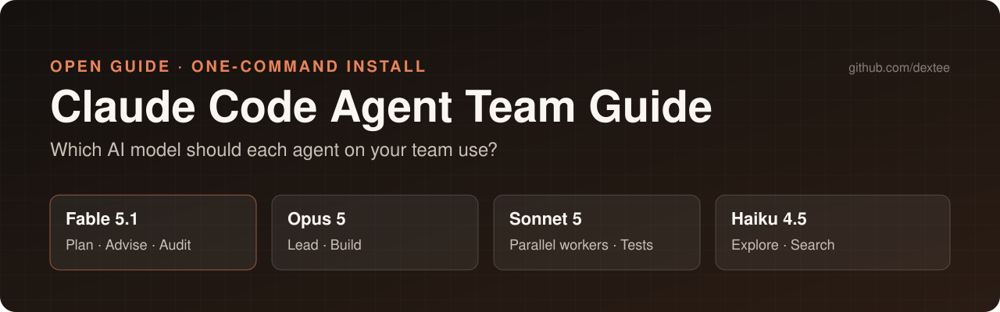

<p align="center"></p>

# Claude Code Model Guide 2026: Fable 5.1 vs Opus 5 vs Sonnet 5 vs Haiku 4.5 for Agent Teams

> **Which Claude model should each agent use in Claude Code?** This is a practical, source-checked playbook for picking models, effort levels, and advisors across a team of Claude Code agents — plus copy-paste subagent files you can drop into any repo today.


[](https://github.com/dextee/claude-code-model-guide/stargazers)

**TL;DR** — Plan and audit with **Claude Fable 5.1**, build with **Claude Opus 5**, run routine and parallel work on **Claude Sonnet 5**, and send search/exploration to **Claude Haiku 4.5**. Tune **effort** before you switch models, and use the **advisor tool** so your builder can consult Fable only at decision points.

---

## Table of contents

- [Why model choice matters now](#why-model-choice-matters-now)
- [Claude model comparison (2026)](#claude-model-comparison-2026)
- [The recommended agent team](#the-recommended-agent-team)
- [Quick start: install the agent team in 60 seconds](#quick-start-install-the-agent-team-in-60-seconds)
- [Effort levels: the cheapest upgrade you are not using](#effort-levels-the-cheapest-upgrade-you-are-not-using)
- [Advisor tool: Opus builds, Fable advises](#advisor-tool-opus-builds-fable-advises)
- [Subagents vs agent teams vs opusplan vs advisor](#subagents-vs-agent-teams-vs-opusplan-vs-advisor)
- [Workflow recipes](#workflow-recipes)
- [Cost control checklist](#cost-control-checklist)
- [Common mistakes](#common-mistakes)
- [FAQ](#faq)
- [Sources](#sources)
- [About the author](#about-the-author)

---

## Why model choice matters now

Claude Code no longer has one "best" model. Anthropic ships a family with very different price and behavior profiles, and Claude Code lets you assign a **different model to every subagent, teammate, and advisor**. Teams that run everything on the most expensive model burn budget on file searches; teams that run everything on the cheapest model get shallow plans and missed bugs.

The fix is the same as with a human team: **senior people review and decide, mid-level people build, juniors fetch and search.**

---

## Claude model comparison (2026)

Prices are Anthropic API list prices per million tokens (MTok).

| Model | Alias in Claude Code | Input / Output | Cache read | Context | Best at |
|---|---|---|---|---|---|
| **Claude Fable 5.1** | `fable` (also `best`) | $10 / $50 | $0.25 | 1M | Hardest, longest work: architecture, root-cause debugging, code review, large refactors, long autonomous sessions |
| **Claude Opus 5** | `opus` | $5 / $25 | $0.50 | 1M | Long agentic coding at half Fable's price. Verifies its own work. Default model on Max, Team Premium, Enterprise, and API |
| **Claude Sonnet 5** | `sonnet` | $2 / $10 | $0.20 | 1M (always) | Daily coding, parallel implementation workers, test running. Default on Pro and Team Standard |
| **Claude Haiku 4.5** | `haiku` | $1 / $5 | $0.10 | 200K | Fast, cheap search, exploration, summarising, simple lookups |

Key facts worth knowing:

- **Fable is never the default.** Select it explicitly with `/model fable` or `claude --model fable`. Fable 5.1 needs Claude Code **v2.1.257+**.
- **Fable 5.1 cache reads cost only 2.5% of input price** ($0.25/MTok) versus the usual 10%. Long cached sessions on Fable are cheaper than the headline price suggests.
- **1M context has no premium** on 4.6-and-later models — a 900K-token request bills at the same rate as a 9K one.
- **On some subscription plans Fable bills to usage credits** instead of your plan limits. The `/model` picker shows "Requires usage credits" when that applies.
- **Fast mode** (`/fast`) is Opus 5 / Opus 4.8 only: up to 2.5× faster at $10 / $50, billed to usage credits on subscriptions.
- Opus 4.7 and later use a newer tokenizer that produces roughly 30% more tokens for the same text — compare cost per *finished task*, not per token.

---

## The recommended agent team

| Role | Model | Effort | Why |
|---|---|---|---|
| **Lead / main session** | Opus 5 (`opus`) | `high` | Best price-to-capability for driving a long build |
| **Advisor** to the lead | Fable 5.1 (`/advisor fable`) | — | Consulted only at decision points, so you pay Fable rates a few times, not every turn |
| **Architect** subagent | Fable 5.1 (`fable`) | `high` | Plans ambiguous or high-stakes work; read-only |
| **Implementer** subagent | Opus 5 (`opus`) | `high` | Writes the code; can run in an isolated git worktree |
| **Worker** subagent | Sonnet 5 (`sonnet`) | `medium` | Parallel, well-specified chunks; tests; migrations |
| **Explorer** subagent | Haiku 4.5 (`haiku`) | `low` | Finds files, reads code, summarises — the most frequent and cheapest job |
| **Auditor** subagent | Fable 5.1 (`fable`) | `xhigh` | Fresh-context review before merge; evidence-only findings |

Why a *separate* auditor? Anthropic's guidance for its newest models is that **fresh-context verifier agents outperform self-critique**. The session that wrote the code is the worst one to review it.

---

## Quick start: install the agent team in 60 seconds

This repo ships ready-to-use subagent definitions in [`.claude/agents/`](.claude/agents):

| File | Model | Role |
|---|---|---|
| [`architect.md`](.claude/agents/architect.md) | `fable` | Read-only planner |
| [`implementer.md`](.claude/agents/implementer.md) | `opus` | Builds features |
| [`worker.md`](.claude/agents/worker.md) | `sonnet` | Parallel well-scoped tasks |
| [`explorer.md`](.claude/agents/explorer.md) | `haiku` | Fast codebase search |
| [`auditor.md`](.claude/agents/auditor.md) | `fable` | Independent pre-merge audit |

**Per project** (shared with your team via git):

```bash
git clone https://github.com/dextee/claude-code-model-guide.git
mkdir -p your-project/.claude/agents
cp claude-code-model-guide/.claude/agents/*.md your-project/.claude/agents/
```

**For every project on your machine**:

```bash
mkdir -p ~/.claude/agents
cp claude-code-model-guide/.claude/agents/*.md ~/.claude/agents/
```

Then merge [`examples/settings.json`](examples/settings.json) into `~/.claude/settings.json`:

```json
{
  "model": "opus",
  "effortLevel": "high",
  "advisorModel": "fable",
  "env": {
    "CLAUDE_CODE_SUBAGENT_MODEL": "sonnet"
  }
}
```

`CLAUDE_CODE_SUBAGENT_MODEL` is only a *default* — any agent file with its own `model:` still wins. That means ad-hoc subagents Claude spawns without a definition run on Sonnet instead of silently inheriting Opus.

Use them by name:

```text
Use the architect agent to plan the payment-retry feature, then the implementer to build it,
then the auditor to review the diff before I merge.
```

---

## Effort levels: the cheapest upgrade you are not using

Effort controls how much the model thinks. It is set per session, per model, or per subagent — and it often matters more than switching models.

| Level | Use it for |
|---|---|
| `low` | Short, scoped, latency-sensitive tasks (search, lookups) |
| `medium` | Cost-sensitive work that can trade a little intelligence |
| `high` | **Default** on every current model. The right starting point |
| `xhigh` | Deep reasoning: audits, tricky multi-file changes |
| `max` | Only when measured to help; prone to overthinking |

How to set it:

```bash
/effort xhigh                 # in a session
claude --effort medium        # one session
CLAUDE_CODE_EFFORT_LEVEL=low  # environment
```

```json
{
  "effortLevel": "high",
  "modelSettings": {
    "claude-fable-5-1": { "effortLevel": "xhigh" }
  }
}
```

In a subagent file, add `effort: low` to the frontmatter.

> **Pro tip:** Anthropic reports that Fable 5.1 at `medium` roughly matches the previous Fable at lower cost, and even `low` often beats older models running at `xhigh`. Try stepping *down* the effort on Fable before stepping down to a cheaper model.

---

## Advisor tool: Opus builds, Fable advises

The advisor tool lets your main model consult a stronger model at key moments — before committing to an approach, when an error keeps recurring, and before declaring a task done. The advisor sees the full conversation. You pay advisor rates only when it is called.

```bash
/advisor fable            # set and save as default
claude --advisor fable    # this session only
/advisor off              # turn it off
```

**Valid pairings** (the advisor must be at least as capable as the main model):

| Main model | Accepted advisors |
|---|---|
| Haiku 4.5 | Fable, Opus, Sonnet |
| Sonnet 5 | Fable, Opus 4.7+, Sonnet 5 |
| **Opus 5** | **Fable, Opus 5** |
| Fable 5.1 | Fable 5.1 only |

Recommended setups:

- **Opus 5 + Fable advisor** — the default in this guide. Opus does the typing; Fable steers.
- **Sonnet 5 + Fable advisor** — strongest budget option: Fable guidance at decision points without running Fable throughout.
- **Haiku 4.5 + Opus advisor** — lowest-cost main model with strong planning.

Requirements: Anthropic API or a Claude subscription (not Bedrock, Vertex/Google Cloud, Foundry, or Claude Platform on AWS). Toggling the advisor does **not** invalidate your prompt cache. Subagents inherit the configured advisor.

---

## Subagents vs agent teams vs opusplan vs advisor

| Approach | When the stronger model runs | Best for | Token cost |
|---|---|---|---|
| **Subagent with `model:`** | For the whole delegated subtask | Focused jobs that just return a result | Lower |
| **Agent team** (experimental) | Each teammate is a full session | Parallel research, review, competing hypotheses | Much higher |
| **`opusplan`** | Opus in plan mode, then Sonnet to execute | Plan-heavy work on a budget. Does **not** use Fable | Low–medium |
| **Advisor tool** | At decision points mid-task | Long tasks where plan quality decides the outcome | Low overhead |
| **`/model` switch** | From the next request on | Manual phase changes (plan in Fable, build in Opus) | Resets cache |

**Agent teams** are enabled with `CLAUDE_CODE_EXPERIMENTAL_AGENT_TEAMS=1`. Start with **3–5 teammates**, give each its own files to avoid overwrites, and name models in your spawn prompt:

```text
Spawn three teammates to review PR #142 using Sonnet:
one on security, one on performance, one on test coverage.
Have them report findings, then synthesise.
```

Teammate model order: model named in the prompt → the subagent definition's `model` → `CLAUDE_CODE_SUBAGENT_MODEL` → the lead's model. Teammates inherit the lead's effort level.

---

## Workflow recipes

### 1. Feature build (the everyday loop)

```text
1. /model opus  + /advisor fable
2. "Use the explorer agent to map everything that touches billing retries."
3. "Use the architect agent to propose a plan. Wait for my approval."
4. "Use the implementer agent to build the approved plan, with tests."
5. "Use the auditor agent to review the diff against the plan."
```

### 2. Hard bug / outage

Switch the main session to Fable: `/model fable`, effort `high`. Describe the **outcome** you want ("find the root cause and prove it"), not the steps. Fable investigates before acting and verifies without reminders.

### 3. Large refactor across many files

Architect (Fable) splits the work into self-contained chunks → several **worker** agents (Sonnet) take one chunk each, ideally with `isolation: worktree` → auditor (Fable, `xhigh`) reviews the combined diff.

### 4. Parallel code review

Agent team of 3 Sonnet reviewers, each with one lens (security, performance, tests), synthesised by the Opus lead. For the deepest check, run `/code-review` at a high level, or `/code-review ultra` for a multi-agent cloud review.

### 5. Budget mode

`/model sonnet` + `/advisor fable` + explorer on Haiku. Most of the quality of Fable-led planning at a fraction of the cost.

---

## Cost control checklist

- [ ] Explorer/search subagents on **Haiku** at `effort: low`.
- [ ] `CLAUDE_CODE_SUBAGENT_MODEL=sonnet` so undefined subagents don't inherit your most expensive model.
- [ ] Try **lower effort** on the strong model before trying a weaker model.
- [ ] Use the **advisor** instead of running Fable for the whole session.
- [ ] Turn fast mode on at the **start** of a conversation, not midway — enabling it re-bills the whole context at fast-mode input rates once.
- [ ] Avoid needless `/model` switches mid-session: caches are per model, so a switch re-reads the context uncached.
- [ ] Watch `/usage`. On plans where Fable uses usage credits, **headless (`-p`) and Agent SDK runs bill Fable without a consent prompt**.
- [ ] Keep agent teams small (3–5). Token cost scales linearly with teammates.

---

## Common mistakes

1. **Running every subagent on Opus or Fable.** Most subagent work is reading files. Haiku does it for a fraction of the price.
2. **Letting the builder audit itself.** Use a fresh-context auditor.
3. **Expecting `opusplan` to use Fable.** It plans with Opus and executes with Sonnet. For Fable planning, use the architect subagent, the advisor, or `/model fable`.
4. **Pairing a Fable main model with an Opus advisor.** It's rejected — Fable 5.1 accepts only a Fable 5.1 advisor.
5. **Putting `max` effort everywhere.** It can overthink and costs more. Measure first.
6. **Over-prescriptive prompts for Fable.** Describe the outcome; let it plan. Drop "remember to run the tests" reminders — it verifies on its own.

---

## FAQ

### What is the best Claude model for Claude Code in 2026?
For the hardest work, **Claude Fable 5.1**. For most coding, **Claude Opus 5** gives the best capability per dollar. Most teams get the best results by mixing them: Opus builds, Fable plans and reviews.

### Is Fable 5.1 better than Opus 5 for coding?
Fable 5.1 is Anthropic's most capable widely released model and gains most on long, ambiguous, multi-hour tasks, code review, and debugging. It costs twice as much as Opus 5. For well-specified implementation work, Opus 5 is usually the better value.

### How do I use a different model for each subagent in Claude Code?
Add `model: haiku` (or `sonnet`, `opus`, `fable`, a full model ID, or `inherit`) to the subagent's YAML frontmatter in `.claude/agents/<name>.md`. Order of precedence: per-invocation model → frontmatter → `CLAUDE_CODE_SUBAGENT_MODEL` → main session model.

### What is the Claude Code advisor tool?
An experimental feature that lets your main model consult a stronger model at decision points. Enable it with `/advisor fable`, `claude --advisor fable`, or `"advisorModel": "fable"` in settings.

### What does `opusplan` do?
It uses Opus in plan mode and switches to Sonnet for execution. It does not involve Fable.

### When should I use Haiku 4.5?
For search, exploration, summarising, and other short, low-risk jobs — especially as a subagent that runs many times per session.

### Which effort level should I use?
Start at `high` (the default). Use `xhigh` for audits and hard multi-file changes, `medium`/`low` for routine or high-volume work. Use `max` only when you have measured that it helps.

### Does the 1M context window cost extra?
No. On Claude 4.6 and later models the full 1M window is billed at standard rates.

### Can I use these agent files with Bedrock or Vertex?
The subagent files work, but aliases may resolve to older models on those providers, and the advisor tool and fast mode are Anthropic-API/subscription only. Pin models with `ANTHROPIC_DEFAULT_OPUS_MODEL`, `ANTHROPIC_DEFAULT_SONNET_MODEL`, and `ANTHROPIC_DEFAULT_FABLE_MODEL`.

---

## Sources

All facts were checked against official documentation on **2026-09-22**. Models and prices change often — open an issue or PR if something here is out of date.

- Claude Code — [Model configuration](https://code.claude.com/docs/en/model-config)
- Claude Code — [Subagents](https://code.claude.com/docs/en/sub-agents)
- Claude Code — [Agent teams](https://code.claude.com/docs/en/agent-teams)
- Claude Code — [Advisor tool](https://code.claude.com/docs/en/advisor)
- Claude Code — [Fast mode](https://code.claude.com/docs/en/fast-mode)
- Claude API — [Pricing](https://platform.claude.com/docs/en/about-claude/pricing)
- Anthropic — [The advisor strategy](https://claude.com/blog/the-advisor-strategy)

---

## About the author

Maintained by **[@dextee](https://github.com/dextee)**, who builds and governs production AI agent systems.

Related work:

- **[Singapore AI Governance Readiness Checklist](https://github.com/dextee/singapore-ai-governance-checklist)**: 24 evidence-oriented review prompts for taking an AI system or agent to production in Singapore, mapped to IMDA's Model AI Governance Framework for Agentic AI.
- **[VYR](https://vyrwork.com/)**: governed AI automation resources.

Follow [@dextee](https://github.com/dextee) for updates when new Claude models ship.

## Contributing

Found a newer model, a price change, or a better workflow? PRs are welcome. See [CONTRIBUTING.md](CONTRIBUTING.md). Please link an official source for any factual change.

If this guide saved you tokens, **⭐ star the repo** so other Claude Code users can find it.

## Disclaimer

This is an independent community guide. It is not affiliated with or endorsed by Anthropic. "Claude" and model names are trademarks of Anthropic.

## License

[MIT](LICENSE)

<!-- Keywords: Claude Code, Claude Code models, Claude Fable 5.1, Claude Opus 5, Claude Sonnet 5, Claude Haiku 4.5, Claude Code subagents, Claude Code agent teams, Claude Code advisor, opusplan, effort level, AI coding agents, multi-agent workflow, Anthropic -->
