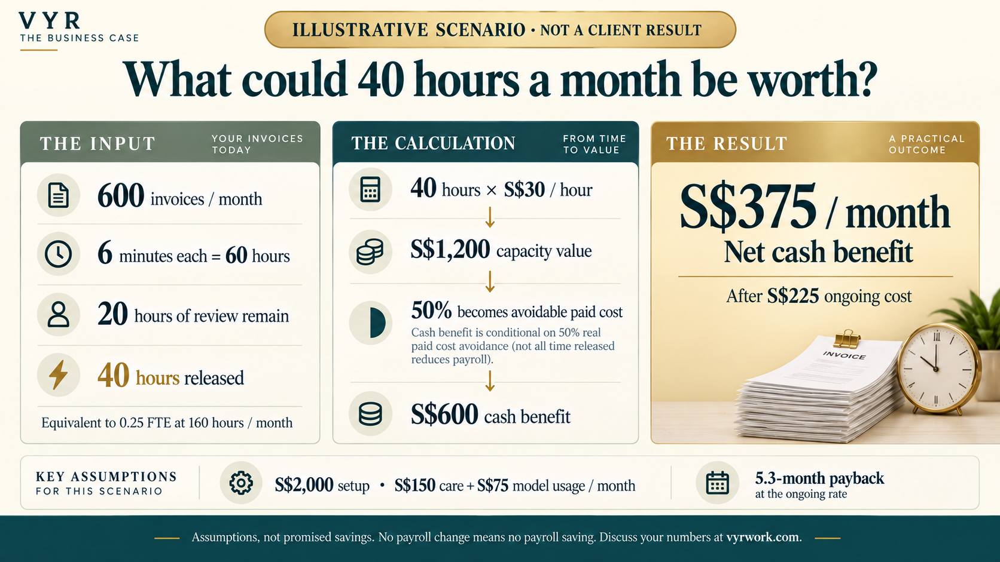

# Could one workflow pay for itself?

**The opportunity is to remove repeatable work, then decide how the released capacity becomes valuable.** It may help you reduce overtime, avoid a planned hire, leave a vacancy unfilled, or let the same team handle more business.

[Ask VYR to assess your numbers →](https://vyrwork.com/contact?utm_source=github&utm_medium=referral&utm_campaign=agent_os_workflows&utm_content=roi_top)

## A 40-hour opportunity

Imagine **600 invoices per month**, each taking **6 minutes** of manual work. That is **60 staff-hours**. If an implemented workflow reduces the remaining review and exception work to **20 hours**, it releases **40 hours per month**.

At an assumed **S$30 per fully loaded hour**, that is **S$1,200 of monthly capacity value**. If half becomes a real reduction in paid labour or an otherwise-needed hire, the cash benefit is **S$600/month**. After **S$225/month** in assumed ongoing costs, the steady-state net cash saving is **S$375/month**.

**These are hypothetical inputs and calculations, not measured VYR results or a savings guarantee.** The amount of time that can actually be removed must be tested on your process.

## Three illustrative scenarios

Each column is a separate hypothetical **single-workflow** project. Figures are SGD; review time already accounts for human oversight.

| Assumption or result | Invoice administration | Booking enquiries | Routine support |
|---|---:|---:|---:|
| Tasks per month — assumed | 600 | 1,200 | 2,400 |
| Manual minutes per task — assumed | 6 | 5 | 5 |
| Baseline staff-hours per month | 60 | 100 | 200 |
| Remaining review / exception hours — assumed | 20 | 20 | 40 |
| **Hours released per month** | **40** | **80** | **160** |
| **Equivalent capacity at 160 hours/FTE** | **0.25 FTE** | **0.50 FTE** | **1.00 FTE** |
| Capacity value at S$30/hour — assumed rate | S$1,200 | S$2,400 | S$4,800 |
| Portion converted to avoidable cash cost — assumed | 50% | 50% | 50% |
| Gross monthly cash benefit | S$600 | S$1,200 | S$2,400 |
| Ongoing cost from month 4 | S$225 | S$250 | S$350 |
| **Net monthly cash benefit from month 4** | **S$375** | **S$950** | **S$2,050** |
| One-time workflow setup assumption | S$2,000 | S$2,000 | S$2,000 |
| **Conservative payback at ongoing monthly rate** | **5.3 months** | **2.1 months** | **1.0 month** |
| Year-one total cost | S$4,250 | S$4,550 | S$5,750 |
| Year-one gross cash benefit | S$7,200 | S$14,400 | S$28,800 |
| **Year-one net cash benefit** | **S$2,950** | **S$9,850** | **S$23,050** |
| **Year-one cash ROI** | **69%** | **216%** | **401%** |

**Pricing basis:** the setup and S$150/month Agent Care assumptions use VYR's published starting price, with three care months included. Estimated model usage is S$75 / S$100 / S$200 per month respectively; these are assumptions, not provider quotes. Actual scope, usage, software licences, data preparation, transition costs and additional support can change the result. [Current VYR pricing](https://vyrwork.com/pricing)

The table assumes all three projects operate for 12 full months after go-live, full benefit from month one, no ramp-up, no added licences, no transition cost and no additional recurring overhead. Replace these assumptions in a real proposal. Figures are pre-tax, with no discounting or revenue uplift included. Conservative payback uses the month-four recurring rate for every month; the annual calculation includes the three-month care allowance.

## How headcount fits into the decision

A workflow releasing **160 hours a month** represents **one FTE of task capacity** under the table's 160-hour assumption. It does not prove that a complete employee role can be removed: the person may also cover customer relationships, exceptional cases and other duties.

Potential routes include reducing paid overtime, avoiding a planned backfill, reducing purchased admin hours, or reorganising a sufficiently large block of work. Count only the paid cost you can actually avoid. Staffing changes, service coverage, transition costs and employment decisions remain with the business.

If the same people stay on the same payroll and use the time for other work, the benefit is capacity rather than payroll savings. That can still support growth, but it should not be presented as a cash cost reduction.

## What if no staffing cost comes out?

Using the invoice example:

| Portion of capacity value becoming avoidable cash cost | Monthly gross cash benefit | Net after S$225 ongoing cost |
|---|---:|---:|
| 0% — time redeployed, payroll unchanged | S$0 | **−S$225** |
| 25% | S$300 | **S$75** |
| 50% — scenario above | S$600 | **S$375** |
| 100% | S$1,200 | **S$975** |

At 50% cash realisation and S$30/hour, the invoice scenario needs **15 hours released per month** to cover S$225 of ongoing cost. Setup recovery is additional. If the process is rare, review remains heavy or no cost can be avoided, the business case may depend on capacity or service quality instead.

## How the numbers are calculated

- Baseline monthly hours = task volume × manual minutes ÷ 60.
- Hours released = baseline hours minus remaining review and exception hours, with a floor of zero.
- Equivalent capacity = released hours ÷ the assumed monthly hours per FTE.
- Capacity value = released hours × fully loaded hourly cost.
- Cash benefit = capacity value × the fraction of paid cost actually avoided.
- Ongoing net cash benefit = cash benefit minus care, model usage and other recurring costs.
- Payback at the ongoing rate = one-time costs ÷ positive ongoing net cash benefit. If net benefit is zero or negative, there is no payback under that case.
- Year-one cash ROI = (12 months of cash benefit − total year-one cost) ÷ total year-one cost.

## Bring your own baseline

For the first conversation, bring approximate volume, current handling time, the review that must remain, your actual labour cost, and whether the time would reduce paid cost or create capacity. VYR can scope the workflow and agree how to test those assumptions.

**[Discuss the potential saving in your workflow →](https://vyrwork.com/contact?utm_source=github&utm_medium=referral&utm_campaign=agent_os_workflows&utm_content=roi_bottom)**

[Explore 14 workflows](docs/workflows/README.md) · [Buyer guide](BUYERS_GUIDE.md) · [Back to VYR Agent OS](README.md)
