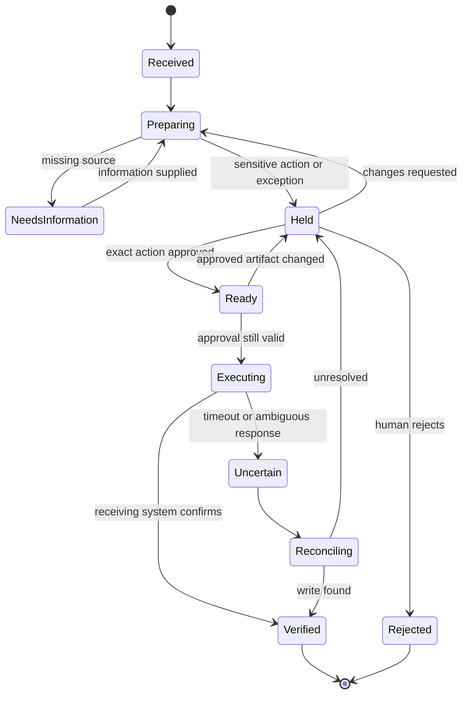

# From business goal to cooperating agents

[← Workflow atlas](README.md)

Start with one measurable result: a sample booking, reviewed invoice draft, accepted trial slot or approved follow-up. Give every role a small responsibility and a specific output that another role can inspect. Use a normal function for deterministic work such as arithmetic, schema validation, database writes or checking an approval digest; not every box needs an LLM.

## Separate the build team from the running workflow

This repository installs five **Claude Code development agents**. They help build a workflow; they are not a ready-to-deploy receptionist, voice system, CRM integration or business runtime.

| Development role | Suggested use in a workflow project |
|---|---|
| Architect / Fable 5.1 | Define dependencies, permissions, failure states and the smallest useful design. |
| Implementer / Opus 5.5 | Build the orchestrator, adapters and difficult business logic. |
| Worker / Sonnet 5 | Implement a bounded adapter or independently reviewable module. |
| Explorer / Haiku 4.5 | Locate existing schemas, code paths and configuration. |
| Auditor / Fable 5.1 | Challenge the implementation against its requirements and failure cases. |

These are the guide's starting recommendations, not measurements or a claim about VYR's selected models. Consult the [model-selection guide](../../README.md#choose-a-model-for-the-task) for current IDs and settings. A business runtime needs its own quality, latency, cost and permission evaluation. A telephone interface also needs voice transport and speech capabilities; choosing a text model alone does not implement a receptionist.

## Handoff contract

Pass a structured packet, not an unbounded transcript. Example below is proposed and uses fictional data.

```json
{
  "run_id": "demo-call-0042",
  "workflow": "ai-receptionist",
  "state": "awaiting_caller_confirmation",
  "from": "availability",
  "to": "booking",
  "environment": "sample",
  "source_refs": ["sample-calendar:slot-1600"],
  "facts": {"service": "60-minute appointment", "slot": "Saturday 16:00"},
  "unknowns": [],
  "allowed_actions": ["read_back_slot", "create_sample_booking_after_confirmation"],
  "decision_owner": "caller_for_slot_staff_for_exceptions",
  "external_write_receipt": null
}
```

A source reference should resolve to the actual dated record in an implementation. Keep personal data minimal and scoped to the receiving role. A run packet is not a shared-memory product. Any persistent cross-workflow context requires an explicit access, retention and hosting design; VYR describes that capability as build-to-order.

## Control the state transitions



This is a proposed implementation pattern. For a standard administrative action allowed by the agreed policy, an explicit release rule can replace per-item approval; the workflow-specific human boundary still applies. Do not make an LLM's own approval sufficient for a human-only decision.

## Prove one end-to-end case

1. Choose a single case from the atlas and define its exact completion receipt.
2. Implement read access and deterministic checks before enabling writes.
3. Run a fictional happy path and an exception path with each handoff visible.
4. Test missing evidence, changed approval, stale availability, duplicate triggers and an ambiguous write response.
5. Reconcile an uncertain write before retrying; use an idempotency key where the receiving system supports it.
6. Measure task success, time to useful handoff, human review load, cost per completed case and error recovery. Set targets with the operator before rollout.

## Copy-ready implementation brief

```text
Build a prototype of [workflow] from this atlas.
Goal: [one outcome]. Environment: sample data first.
Inputs: [named sources]. Output: [specific verified record].
Roles: [use only roles with distinct responsibilities].
Parallel work: [independent checks that can run together].
Handoffs: structured facts, source references, unknowns and permissions.
Human decision: [exact person/role and action they control].
Failure paths: missing data, conflicts, stale state, rejection and timeout.
Completion evidence: [receiving-system receipt or explicit handoff record].
Do not claim deployment or measured results from the prototype.
Use the Claude Code build team to implement and independently review it.
```
