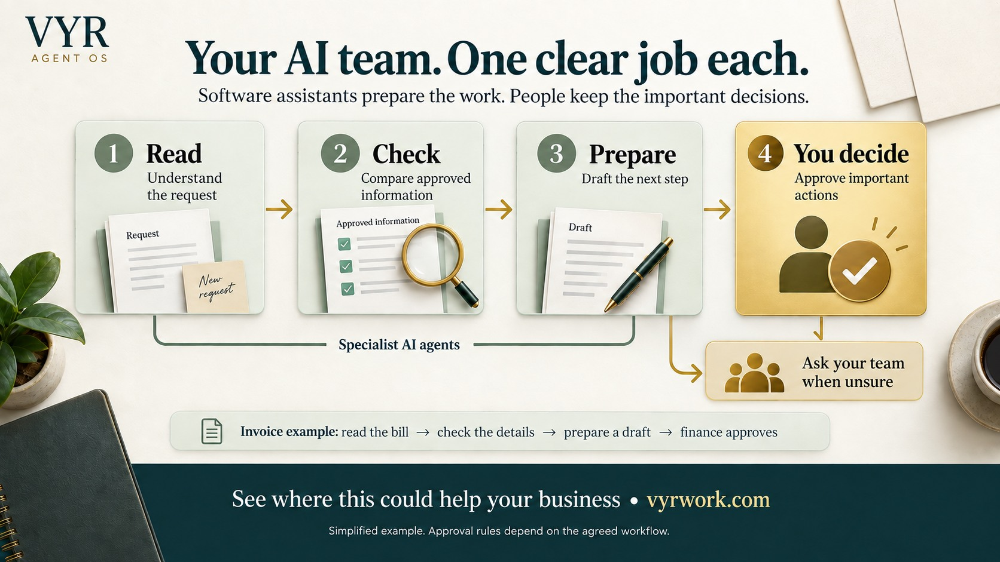

[← VYR Agent OS](../../README.md)

# Find a workflow worth taking off your team's desk

**Find the task your team would be glad to stop repeating.** Each example shows what software assistants could prepare, where your people stay in control and what to discuss with VYR. You do not need to know which AI tool to choose.

**[Help me choose the right first task →](https://vyrwork.com/contact?utm_source=github&utm_medium=referral&utm_campaign=agent_os_workflows&utm_content=workflow_index_top)** · [Packages and pricing](https://vyrwork.com/pricing?utm_source=github&utm_medium=referral&utm_campaign=agent_os_workflows&utm_content=workflow_index_pricing)

## Calls, bookings and customer service

| Workflow | Where it fits | Status |
|---|---|---|
| [AI Receptionist](ai-receptionist.md) | booking enquiries keep interrupting your front desk | DEMO |
| [Clinic Front Desk](clinics.md) | appointment administration takes staff away from patients | BUILT FOR YOU |
| [Beauty & Wellness](beauty-and-wellness.md) | bookings require checking several calendars and package records | BUILT FOR YOU |
| [Tuition Trial Booking](tuition-centres.md) | trial-class enquiries create repeated back-and-forth | BUILT FOR YOU |
| [Customer Support](customer-support.md) | enquiries bounce between inboxes and people | BUILT FOR YOU |

**[Discuss our calls, bookings or customer inbox →](https://vyrwork.com/contact?utm_source=github&utm_medium=referral&utm_campaign=agent_os_workflows&utm_content=workflow_index_customer_service)**

## Sales and marketing operations

| Workflow | Where it fits | Status |
|---|---|---|
| [Prospect Research](lead-generation.md) | sales spends too much time assembling prospect lists | LIVE |
| [Sales Follow-up](lead-nurture.md) | follow-ups depend on someone remembering a stalled deal | BUILT FOR YOU |
| [Content Operations](content-operations.md) | good content stalls between research, editing and approval | LIVE |
| [Social Command Center](social-command-center.md) | social reporting and release decisions are scattered | LIVE |

**[Discuss the admin behind our sales and marketing →](https://vyrwork.com/contact?utm_source=github&utm_medium=referral&utm_campaign=agent_os_workflows&utm_content=workflow_index_sales)**

## Finance, people and operations

| Workflow | Where it fits | Status |
|---|---|---|
| [Invoice Processing](invoice-processing.md) | invoices arrive faster than finance can reconcile them | BUILT FOR YOU |
| [F&B Supplier Reorder](food-and-beverage.md) | stock checks and supplier orders live in separate places | BUILT FOR YOU |
| [Employee Onboarding](hr-operations.md) | onboarding depends on chasing several people | BUILT FOR YOU |
| [Recruitment Screening](recruitment-screening.md) | application review is hard to keep consistent | BUILT FOR YOU |
| [Compliance Evidence](compliance-evidence.md) | preparing for review means chasing records across systems | BUILT FOR YOU |

**[Discuss our finance or people processes →](https://vyrwork.com/contact?utm_source=github&utm_medium=referral&utm_campaign=agent_os_workflows&utm_content=workflow_index_operations)**

## What those labels mean

**LIVE — used inside VYR.** **DEMO — try it with sample data.** **BUILT FOR YOU — designed for a custom implementation.** These labels distinguish VYR's own operations, demonstrations and designs that still need an agreed client build.

Content generation is paused pending approvals; prospect research sends no outreach; the social console is read-only, with a separate approved publishing path. The receptionist has no live booking connection. Each example explains its own boundaries.

Source status checked **27 September 2026** against [VYR Agent OS](https://vyrwork.com/agent-os?utm_source=github&utm_medium=referral&utm_campaign=agent_os_workflows&utm_content=workflow_index_source). Illustrative examples are not client case studies. [Source register](SOURCES.md)

## Your process does not need to match a card exactly

Bring one bottleneck and the software you use. VYR will assess whether an existing design is a useful starting point. A good first message is: “We handle about ___ each month. Our team spends too much time on ___.”

**[Tell VYR what you want to improve →](https://vyrwork.com/contact?utm_source=github&utm_medium=referral&utm_campaign=agent_os_workflows&utm_content=workflow_index_bottom)** · [Prepare for the conversation](../../BUYERS_GUIDE.md) · [Meet Dexter Ng](../../MEET_DEXTER.md)
