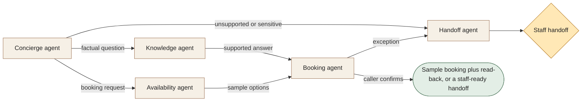

[← All workflows](README.md) · [VYR Agent OS](../../README.md)

# AI Receptionist

## When booking enquiries keep interrupting your front desk

For appointment-led businesses exploring a multilingual first point of contact. See how a caller can move from a question to a sample booking, with staff taking over exceptions.

**[Ask for a receptionist demonstration with VYR →](https://vyrwork.com/contact?utm_source=github&utm_medium=referral&utm_campaign=agent_os_workflows&utm_content=ai-receptionist_top)**

**Status: DEMO.** Working voice software using sample business data; no live booking connection. Status checked 27 September 2026 against [VYR's workflow page](https://vyrwork.com/agent-os/spa-demo?utm_source=github&utm_medium=referral&utm_campaign=agent_os_workflows&utm_content=ai-receptionist_source).

## What the workflow would help you achieve

Turn an inbound call into a correct sample booking or a useful staff handoff.

## How the work moves

The concierge dispatches a factual enquiry to knowledge and a booking enquiry to availability. It joins their findings before asking the caller to choose. Sensitive or unsupported requests branch directly to a person.

This is a simplified service illustration. It is not a screenshot or a claim about the exact deployed agent roster.

**Your team stays in control:** Staff own sensitive requests, policy exceptions and unsupported questions.

**Scope boundary:** Every booking is a simulation. Do not represent a sample slot as a real appointment.

## A conversation starter

Illustrative scenario: a caller requests a 60-minute appointment on Saturday. Availability returns 14:00 and 16:00 from the demo calendar. The caller chooses 16:00; the booking agent repeats the date and time and records a sample booking. A refund question is transferred with its context.

This example is fictional; it is not a customer result or a promise of measured savings.

## What VYR would scope with you

Your enquiry types, opening hours, booking system, languages and staff handoff rules.

VYR reviews the current steps, the integration access available, the human decisions and an observable completion condition. Compatibility, timing and final deliverables are confirmed in the written scope.

## Consider the business case

Estimate the time this process consumes, the review that would remain, and whether freed capacity would avoid a paid cost. [See the ROI and staffing-capacity examples](../../ROI.md).

## Take the next step

**[Ask for a receptionist demonstration with VYR →](https://vyrwork.com/contact?utm_source=github&utm_medium=referral&utm_campaign=agent_os_workflows&utm_content=ai-receptionist_bottom)**

Prefer a short conversation? [WhatsApp VYR](https://wa.me/6598176520?text=Hi%20VYR%2C%20I%20found%20your%20AI%20Receptionist%20workflow%20on%20GitHub.%20I%20would%20like%20to%20discuss%20automating%20a%20business%20process.). Tell us which process takes time, the systems involved and the exception your team most often has to resolve.

[Packages and pricing](https://vyrwork.com/pricing?utm_source=github&utm_medium=referral&utm_campaign=agent_os_workflows&utm_content=ai-receptionist_pricing) · [What happens after an enquiry](../../BUYERS_GUIDE.md) · [Explore all 14 workflows](README.md)
