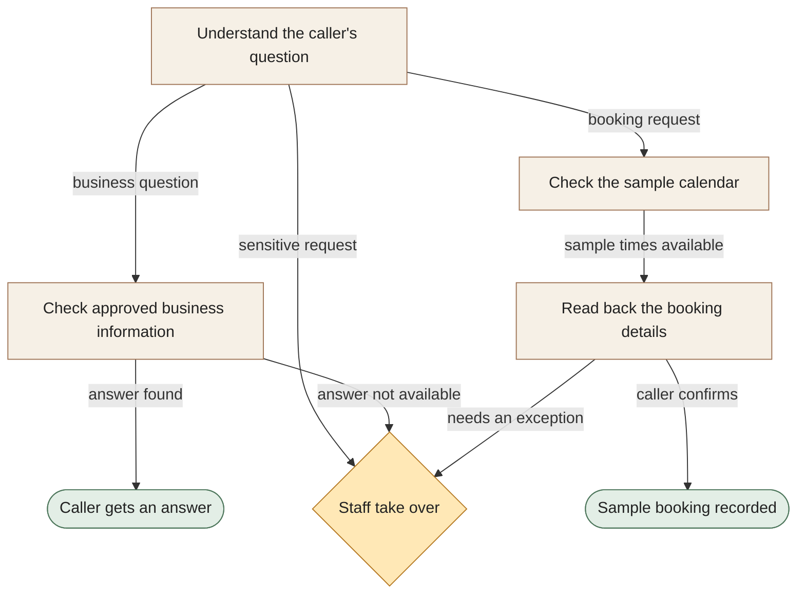

[← All workflows](README.md) · [VYR Agent OS](../../README.md)

# AI Receptionist

## Your front desk should not have to repeat the same answers all day

See a multilingual voice demo answer business questions, check a sample calendar and guide a caller through a sample booking. Staff take over requests that need a person.

**The business benefit:** Explore how fewer routine interruptions could give your team more time for the customers already in front of them.

**Worth discussing if...** calls regularly interrupt appointments, or staff spend time repeating opening hours, service details and booking options.

**[Ask for a receptionist demo →](https://vyrwork.com/contact?utm_source=github&utm_medium=referral&utm_campaign=agent_os_workflows&utm_content=ai-receptionist_top)** · [WhatsApp VYR](https://wa.me/6598176520?text=Hi%20VYR%2C%20I%20found%20your%20AI%20Receptionist%20example%20on%20GitHub.%20My%20business%3A%20__.%20Tasks%20per%20month%3A%20__.%20Software%20we%20use%3A%20__.%20I%20would%20like%20to%20discuss%20whether%20this%20could%20save%20us%20time%20or%20money.)

**Status: DEMO.** Working voice software using sample business data; no live booking connection. Status checked 27 September 2026 against [VYR's workflow page](https://vyrwork.com/agent-os/spa-demo?utm_source=github&utm_medium=referral&utm_campaign=agent_os_workflows&utm_content=ai-receptionist_source).

## What your team would get

A clear answer, a confirmed sample booking or a handover that tells staff what the caller needs.

## How the assistants work together

AI agents are software assistants with different jobs. One assistant understands the question. Another checks the business information; a calendar assistant checks sample availability when needed. The booking assistant reads the details back before the caller confirms. Questions that need judgment go to staff.

This diagram explains the service in simple steps; it is not a screenshot or an exact system design.

**Your team stays in control:** Staff handle sensitive requests, policy exceptions and questions the assistant cannot answer.

**What to know:** This demo uses sample information and calendars. Every booking is a simulation, with no live client booking connection.

**[Discuss the calls your team wants help with →](https://vyrwork.com/contact?utm_source=github&utm_medium=referral&utm_campaign=agent_os_workflows&utm_content=ai-receptionist_flow)**

## Picture it in your business

Illustrative scenario: A caller asks when you open, then requests a Saturday appointment. The information assistant answers the first question; the calendar assistant offers 14:00 and 16:00 from the sample calendar. The caller chooses 16:00 and hears the details read back. A refund question goes to staff with the conversation attached.

This example is fictional, not a client result or a measured saving.

## What we would discuss

Your most common questions, opening hours, booking software, languages and the requests staff must handle.

You do not need a technical brief. Describe the task in your own words; VYR assesses the software connections, work involved and decisions that stay with your team before confirming a written scope and price.

## Could it be worth the investment?

Start with how often this task happens and how long it takes today. Subtract the checking your team still needs to do. Time saved may reduce paid overtime or avoid a future hire; it becomes a cash saving only when a paid cost is actually avoided. [See the worked savings and payback examples](../../ROI.md).

**[Explore a receptionist for your business →](https://vyrwork.com/contact?utm_source=github&utm_medium=referral&utm_campaign=agent_os_workflows&utm_content=ai-receptionist_bottom)** · [Send your brief on WhatsApp](https://wa.me/6598176520?text=Hi%20VYR%2C%20I%20found%20your%20AI%20Receptionist%20example%20on%20GitHub.%20My%20business%3A%20__.%20Tasks%20per%20month%3A%20__.%20Software%20we%20use%3A%20__.%20I%20would%20like%20to%20discuss%20whether%20this%20could%20save%20us%20time%20or%20money.)

The WhatsApp draft asks for your business, approximate tasks per month and software. Rough figures are enough to start a conversation.

[Packages and pricing](https://vyrwork.com/pricing?utm_source=github&utm_medium=referral&utm_campaign=agent_os_workflows&utm_content=ai-receptionist_pricing) · [What happens after an enquiry](../../BUYERS_GUIDE.md) · [Explore all 14 workflows](README.md) · [Meet Dexter Ng](../../MEET_DEXTER.md)
