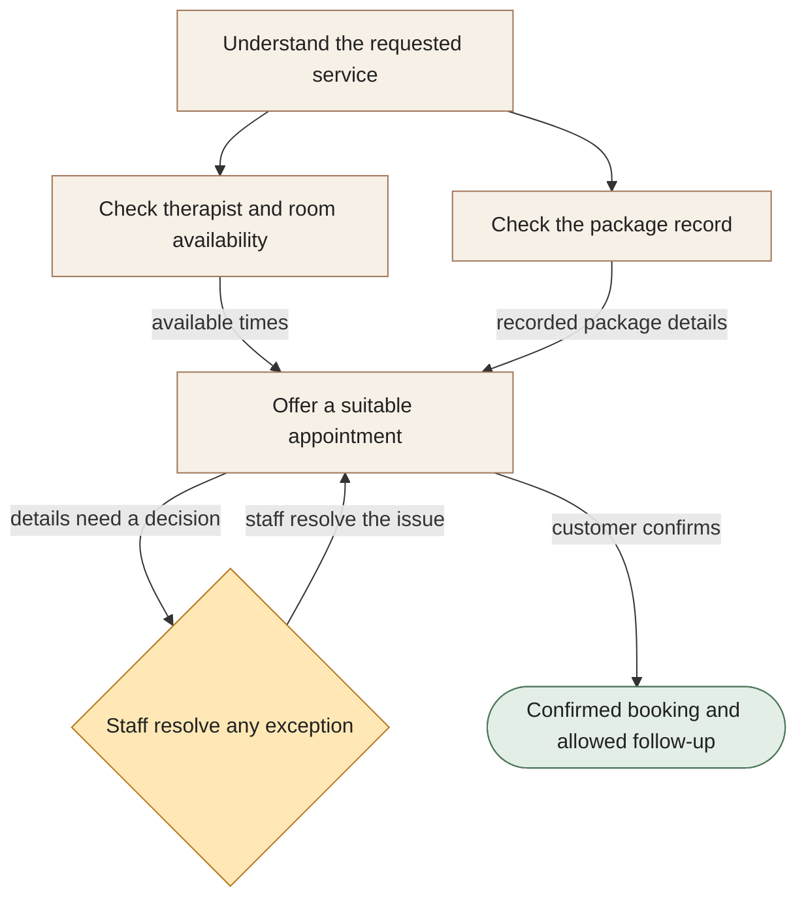

[← All workflows](README.md) · [VYR Agent OS](../../README.md)

# Beauty & Wellness

## Stop checking three places just to offer one appointment

A proposed booking service for salons and wellness businesses that need to match the customer, treatment, therapist, room and package details.

**The business benefit:** Aim to reduce the back-and-forth at reception by bringing the information needed for a booking into one place.

**Worth discussing if...** staff repeatedly switch between calendars and package records before they can confirm an appointment.

**[Discuss an easier booking process →](https://vyrwork.com/contact?utm_source=github&utm_medium=referral&utm_campaign=agent_os_workflows&utm_content=beauty-and-wellness_top)** · [WhatsApp VYR](https://wa.me/6598176520?text=Hi%20VYR%2C%20I%20found%20your%20Beauty%20%26%20Wellness%20example%20on%20GitHub.%20My%20business%3A%20__.%20Tasks%20per%20month%3A%20__.%20Software%20we%20use%3A%20__.%20I%20would%20like%20to%20discuss%20whether%20this%20could%20save%20us%20time%20or%20money.)

**Status: BUILT FOR YOU.** Build-to-order salon booking and package-reference workflow; no running salon deployment is claimed. Status checked 27 September 2026 against [VYR's workflow page](https://vyrwork.com/agent-os/beauty-flow?utm_source=github&utm_medium=referral&utm_campaign=agent_os_workflows&utm_content=beauty-and-wellness_source).

## What your team would get

An appointment that fits the available staff and rooms, with package questions resolved by your team.

## How the assistants work together

AI agents are software assistants with different jobs. A booking assistant gathers the request. Two other assistants check staff and room availability and the relevant package record. Their findings come back together before a booking is confirmed. Staff resolve disputed details.

This diagram explains the service in simple steps; it is not a screenshot or an exact system design.

**Your team stays in control:** Staff decide treatment suitability, refunds, price changes, package disputes and exceptional bookings.

**What to know:** Checking a package does not authorise a refund. The service would not give treatment advice or invent an available slot.

**[Show us where reception gets stuck →](https://vyrwork.com/contact?utm_source=github&utm_medium=referral&utm_campaign=agent_os_workflows&utm_content=beauty-and-wellness_flow)**

## Picture it in your business

Illustrative scenario: A requested therapist is available but the required room is occupied. The calendar check finds a later time. If the customer disputes the package balance, staff resolve that question before any package-based booking is promised.

This example is fictional, not a client result or a measured saving.

## What we would discuss

Your service list, therapist and room calendars, package records and the booking exceptions staff handle.

You do not need a technical brief. Describe the task in your own words; VYR assesses the software connections, work involved and decisions that stay with your team before confirming a written scope and price.

## Could it be worth the investment?

Start with how often this task happens and how long it takes today. Subtract the checking your team still needs to do. Time saved may reduce paid overtime or avoid a future hire; it becomes a cash saving only when a paid cost is actually avoided. [See the worked savings and payback examples](../../ROI.md).

**[Explore booking help for your salon →](https://vyrwork.com/contact?utm_source=github&utm_medium=referral&utm_campaign=agent_os_workflows&utm_content=beauty-and-wellness_bottom)** · [Send your brief on WhatsApp](https://wa.me/6598176520?text=Hi%20VYR%2C%20I%20found%20your%20Beauty%20%26%20Wellness%20example%20on%20GitHub.%20My%20business%3A%20__.%20Tasks%20per%20month%3A%20__.%20Software%20we%20use%3A%20__.%20I%20would%20like%20to%20discuss%20whether%20this%20could%20save%20us%20time%20or%20money.)

The WhatsApp draft asks for your business, approximate tasks per month and software. Rough figures are enough to start a conversation.

[Packages and pricing](https://vyrwork.com/pricing?utm_source=github&utm_medium=referral&utm_campaign=agent_os_workflows&utm_content=beauty-and-wellness_pricing) · [What happens after an enquiry](../../BUYERS_GUIDE.md) · [Explore all 14 workflows](README.md) · [Meet Dexter Ng](../../MEET_DEXTER.md)
