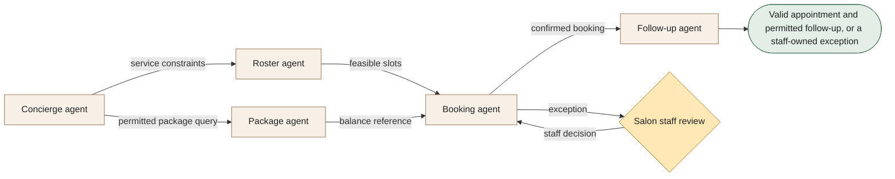

[← All workflows](README.md) · [VYR Agent OS](../../README.md)

# Beauty & Wellness

## When bookings require checking several calendars and package records

For salons and wellness businesses coordinating therapists, rooms and service duration. Bring availability and package references together before confirming the permitted booking.

**[Discuss your booking workflow with VYR →](https://vyrwork.com/contact?utm_source=github&utm_medium=referral&utm_campaign=agent_os_workflows&utm_content=beauty-and-wellness_top)**

**Status: BUILT FOR YOU.** Build-to-order salon booking and package-reference workflow; no running salon deployment is claimed. Status checked 27 September 2026 against [VYR's workflow page](https://vyrwork.com/agent-os/beauty-flow?utm_source=github&utm_medium=referral&utm_campaign=agent_os_workflows&utm_content=beauty-and-wellness_source).

## What the workflow would help you achieve

Coordinate service, therapist, room and package information into a valid booking.

## How the work moves

Concierge requests roster and package checks in parallel. Booking joins their results without inventing entitlement. Staff resolve treatment, pricing or package exceptions before the permitted outcome is recorded.

This is a simplified service illustration. It is not a screenshot or a claim about the exact deployed agent roster.

**Your team stays in control:** Staff own suitability, refunds, price changes, package disputes and exceptional bookings.

**Scope boundary:** Package lookup is not refund authority. No treatment advice or unsupported availability.

## A conversation starter

Illustrative scenario: a requested therapist is free but the required room is occupied. Roster offers a later slot. If the package record is disputed, staff resolve it before any package-based booking promise.

This example is fictional; it is not a customer result or a promise of measured savings.

## What VYR would scope with you

Your service list, booking calendar, package register and staff exception rules.

VYR reviews the current steps, the integration access available, the human decisions and an observable completion condition. Compatibility, timing and final deliverables are confirmed in the written scope.

## Consider the business case

Estimate the time this process consumes, the review that would remain, and whether freed capacity would avoid a paid cost. [See the ROI and staffing-capacity examples](../../ROI.md).

## Take the next step

**[Discuss your booking workflow with VYR →](https://vyrwork.com/contact?utm_source=github&utm_medium=referral&utm_campaign=agent_os_workflows&utm_content=beauty-and-wellness_bottom)**

Prefer a short conversation? [WhatsApp VYR](https://wa.me/6598176520?text=Hi%20VYR%2C%20I%20found%20your%20Beauty%20%26%20Wellness%20workflow%20on%20GitHub.%20I%20would%20like%20to%20discuss%20automating%20a%20business%20process.). Tell us which process takes time, the systems involved and the exception your team most often has to resolve.

[Packages and pricing](https://vyrwork.com/pricing?utm_source=github&utm_medium=referral&utm_campaign=agent_os_workflows&utm_content=beauty-and-wellness_pricing) · [What happens after an enquiry](../../BUYERS_GUIDE.md) · [Explore all 14 workflows](README.md)
