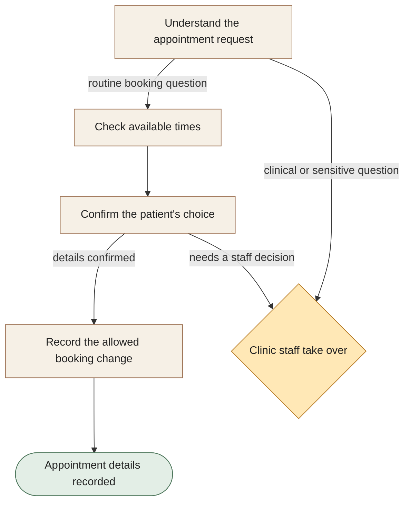

[← All workflows](README.md) · [VYR Agent OS](../../README.md)

# Clinic Front Desk

## Give your front desk more time for patients

A proposed assistant for routine appointment questions, changes and reminders. Clinical questions stay with your clinic staff.

**The business benefit:** Explore how reducing repeated booking administration could free staff to help patients who need personal attention.

**Worth discussing if...** appointment changes and routine booking questions take up a recurring part of your front desk workload.

**[Discuss help for your clinic front desk →](https://vyrwork.com/contact?utm_source=github&utm_medium=referral&utm_campaign=agent_os_workflows&utm_content=clinics_top)** · [WhatsApp VYR](https://wa.me/6598176520?text=Hi%20VYR%2C%20I%20found%20your%20Clinic%20Front%20Desk%20example%20on%20GitHub.%20My%20business%3A%20__.%20Tasks%20per%20month%3A%20__.%20Software%20we%20use%3A%20__.%20I%20would%20like%20to%20discuss%20whether%20this%20could%20save%20us%20time%20or%20money.)

**Status: BUILT FOR YOU.** Build-to-order administrative workflow; no deployed clinic result is claimed. Status checked 27 September 2026 against [VYR's workflow page](https://vyrwork.com/agent-os/clinic-flow?utm_source=github&utm_medium=referral&utm_campaign=agent_os_workflows&utm_content=clinics_source).

## What your team would get

A clear appointment record or a handover to the right staff member, with the patient’s request attached.

## How the assistants work together

AI agents are software assistants with different jobs. One assistant identifies the administrative request. A calendar assistant finds suitable times, and a confirmation assistant checks the patient’s choice before recording an allowed change. Clinical or sensitive questions go directly to staff.

This diagram explains the service in simple steps; it is not a screenshot or an exact system design.

**Your team stays in control:** Clinic staff make clinical decisions, resolve identity questions and decide how sensitive records or exceptional requests are handled.

**What to know:** No diagnosis, symptom assessment or clinical advice. VYR must assess compatibility with your booking system.

**[Explore the booking tasks you could simplify →](https://vyrwork.com/contact?utm_source=github&utm_medium=referral&utm_campaign=agent_os_workflows&utm_content=clinics_flow)**

## Picture it in your business

Illustrative scenario: A patient asks to move an appointment to Friday. A suitable time is proposed. When the patient also asks whether new symptoms need treatment, that question goes to clinic staff without the assistant interpreting the symptoms.

This example is fictional, not a client result or a measured saving.

## What we would discuss

Your booking software, routine appointment requests, staff responsibilities and sensitive situations.

You do not need a technical brief. Describe the task in your own words; VYR assesses the software connections, work involved and decisions that stay with your team before confirming a written scope and price.

## Could it be worth the investment?

Start with how often this task happens and how long it takes today. Subtract the checking your team still needs to do. Time saved may reduce paid overtime or avoid a future hire; it becomes a cash saving only when a paid cost is actually avoided. [See the worked savings and payback examples](../../ROI.md).

**[Talk through your clinic’s appointment process →](https://vyrwork.com/contact?utm_source=github&utm_medium=referral&utm_campaign=agent_os_workflows&utm_content=clinics_bottom)** · [Send your brief on WhatsApp](https://wa.me/6598176520?text=Hi%20VYR%2C%20I%20found%20your%20Clinic%20Front%20Desk%20example%20on%20GitHub.%20My%20business%3A%20__.%20Tasks%20per%20month%3A%20__.%20Software%20we%20use%3A%20__.%20I%20would%20like%20to%20discuss%20whether%20this%20could%20save%20us%20time%20or%20money.)

The WhatsApp draft asks for your business, approximate tasks per month and software. Rough figures are enough to start a conversation.

[Packages and pricing](https://vyrwork.com/pricing?utm_source=github&utm_medium=referral&utm_campaign=agent_os_workflows&utm_content=clinics_pricing) · [What happens after an enquiry](../../BUYERS_GUIDE.md) · [Explore all 14 workflows](README.md) · [Meet Dexter Ng](../../MEET_DEXTER.md)
