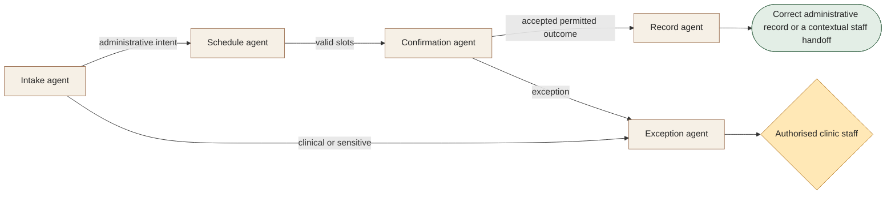

[← All 14 workflows](README.md) · [Guide](../../README.md) · [VYR source](https://vyrwork.com/agent-os/clinic-flow)

# 05. Clinic Front Desk

**BUILT FOR YOU · Checked 27 September 2026**

Build-to-order administrative workflow; no deployed clinic result is claimed.

> **Goal:** Resolve appointment administration while keeping clinical questions with clinic staff.

The role design, worked example and evaluation below are educational proposals. The status and workflow boundary come from the linked VYR page; these role names are not a claim about its exact deployed agent roster.

## Trigger and collaboration

A patient sends an appointment or rescheduling request.

Intake routes administrative requests to schedule. Confirmation returns details for acceptance; exception checks can interrupt the path at any point. Record consumes only the permitted administrative outcome.

## What each agent passes forward

| Role | Receives | Produces |
|---|---|---|
| Intake agent | Approved channel + booking request | Administrative intent and supplied constraints |
| Schedule agent | Practitioner schedule + constraints | Available appointment options |
| Confirmation agent | Chosen option + administrative policy | Booking or reminder proposal |
| Exception agent | Clinical, identity or sensitive-record issue | Authorised-staff handoff |
| Record agent | Confirmed administrative decision | Booking state, reminder and audit entry |

**Human decision:** Clinic staff own clinical judgment, identity decisions, sensitive records and exceptional release.

**Boundary:** No diagnosis, symptom triage or clinical advice. Booking-system compatibility requires assessment.

**Done means:** Correct administrative record or a contextual staff handoff.

## Worked example

Fictional run: a patient asks to move an appointment to Friday. A matching slot is proposed. When the patient also asks whether new symptoms require treatment, the agent passes that question to staff instead of interpreting it.

This is a fictional scenario, not a customer result or a performance claim.

## How to evaluate it

Evaluate schedule consistency, clinical-question routing, identity holds and record-write receipts.

Keep a run ID, dated source references, permitted actions, current state, unresolved questions and decision owner with every handoff. Confirm external writes from the receiving system before declaring them complete. See the [build playbook](BUILD_PLAYBOOK.md) for implementation and model-role guidance.

## Artwork

The [image prompt set](IMAGE_PROMPTS.md) includes a dedicated illustration for this workflow. Generation provenance and current asset availability are tracked in [ARTWORK.md](ARTWORK.md).
