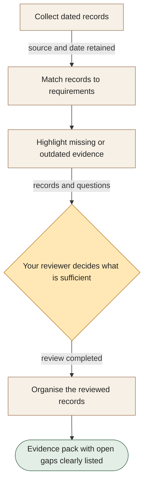

[← All workflows](README.md) · [VYR Agent OS](../../README.md)

# Compliance Evidence

## Spend less time chasing records before a review

A proposed service to collect the documents your reviewer needs, show where they came from and make missing information easy to spot.

**The business benefit:** Aim to reduce the manual searching and chasing involved in preparing a review, while keeping the reviewer’s decisions clear.

**Worth discussing if...** your team repeatedly gathers records from several systems for audits, internal checks or customer reviews.

**[Discuss easier evidence preparation →](https://vyrwork.com/contact?utm_source=github&utm_medium=referral&utm_campaign=agent_os_workflows&utm_content=compliance-evidence_top)** · [WhatsApp VYR](https://wa.me/6598176520?text=Hi%20VYR%2C%20I%20found%20your%20Compliance%20Evidence%20example%20on%20GitHub.%20My%20business%3A%20__.%20Tasks%20per%20month%3A%20__.%20Software%20we%20use%3A%20__.%20I%20would%20like%20to%20discuss%20whether%20this%20could%20save%20us%20time%20or%20money.)

**Status: BUILT FOR YOU.** Build-to-order evidence preparation; it does not certify compliance or control effectiveness. Status checked 27 September 2026 against [VYR's workflow page](https://vyrwork.com/agent-os/compliance-flow?utm_source=github&utm_medium=referral&utm_campaign=agent_os_workflows&utm_content=compliance-evidence_source).

## What your team would get

An organised evidence folder and checklist showing dates, responsible people and the information still missing.

## How the assistants work together

AI agents are software assistants with different jobs. One assistant collects dated records. Another links them to the relevant requirement, and a checker highlights gaps. Your reviewer decides whether the records are sufficient before the final pack is assembled.

This diagram explains the service in simple steps; it is not a screenshot or an exact system design.

**Your team stays in control:** The responsible manager, compliance lead or auditor decides whether evidence is sufficient and what it means.

**What to know:** Organising records does not certify compliance or prove a control works. Missing evidence remains visible.

**[Show us the records your team keeps chasing →](https://vyrwork.com/contact?utm_source=github&utm_medium=referral&utm_campaign=agent_os_workflows&utm_content=compliance-evidence_flow)**

## Picture it in your business

Illustrative scenario: A requirement has an old policy document but no recent record showing that the policy was followed. The checker flags the gap. The reviewer assigns someone to obtain the missing record; the final pack keeps it marked as outstanding.

This example is fictional, not a client result or a measured saving.

## What we would discuss

The requirements being reviewed, records to include, people responsible for them and your review schedule.

You do not need a technical brief. Describe the task in your own words; VYR assesses the software connections, work involved and decisions that stay with your team before confirming a written scope and price.

## Could it be worth the investment?

Start with how often this task happens and how long it takes today. Subtract the checking your team still needs to do. Time saved may reduce paid overtime or avoid a future hire; it becomes a cash saving only when a paid cost is actually avoided. [See the worked savings and payback examples](../../ROI.md).

**[Explore a clearer review-ready evidence pack →](https://vyrwork.com/contact?utm_source=github&utm_medium=referral&utm_campaign=agent_os_workflows&utm_content=compliance-evidence_bottom)** · [Send your brief on WhatsApp](https://wa.me/6598176520?text=Hi%20VYR%2C%20I%20found%20your%20Compliance%20Evidence%20example%20on%20GitHub.%20My%20business%3A%20__.%20Tasks%20per%20month%3A%20__.%20Software%20we%20use%3A%20__.%20I%20would%20like%20to%20discuss%20whether%20this%20could%20save%20us%20time%20or%20money.)

The WhatsApp draft asks for your business, approximate tasks per month and software. Rough figures are enough to start a conversation.

[Packages and pricing](https://vyrwork.com/pricing?utm_source=github&utm_medium=referral&utm_campaign=agent_os_workflows&utm_content=compliance-evidence_pricing) · [What happens after an enquiry](../../BUYERS_GUIDE.md) · [Explore all 14 workflows](README.md) · [Meet Dexter Ng](../../MEET_DEXTER.md)
