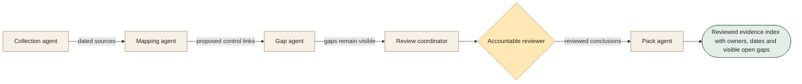

[← All 14 workflows](README.md) · [Guide](../../README.md) · [VYR source](https://vyrwork.com/agent-os/compliance-flow)

# 13. Compliance Evidence

**BUILT FOR YOU · Checked 27 September 2026**

Build-to-order evidence preparation; it does not certify compliance or control effectiveness.

> **Goal:** Give a reviewer a traceable evidence pack and an honest gap register.

The role design, worked example and evaluation below are educational proposals. The status and workflow boundary come from the linked VYR page; these role names are not a claim about its exact deployed agent roster.

## Trigger and collaboration

A scheduled review opens for an approved control set.

Collection preserves provenance. Mapping proposes links; gap review challenges sufficiency. A person assesses meaning before the pack agent assembles the reviewed record.

## What each agent passes forward

| Role | Receives | Produces |
|---|---|---|
| Collection agent | In-scope events + documents | Evidence records with source and timestamp |
| Mapping agent | Evidence + control register | Proposed evidence-to-control links |
| Gap agent | Mappings + evidence requirements | Missing, stale or conflicting items |
| Review coordinator | Evidence + gaps + owners | Accountable-review packet |
| Pack agent | Recorded reviewer conclusions | Indexed evidence pack with unresolved gaps |

**Human decision:** The control owner, compliance lead or auditor decides sufficiency and conclusions.

**Boundary:** No automated certification. An absent alert is not proof that a control works.

**Done means:** Reviewed evidence index with owners, dates and visible open gaps.

## Worked example

Fictional run: a control has an old policy but no current execution record. Gap review marks the evidence incomplete. The reviewer assigns an owner and due date; the pack keeps the gap visible instead of displaying a pass badge.

This is a fictional scenario, not a customer result or a performance claim.

## How to evaluate it

Test provenance completeness, stale-record detection, conflicting-evidence handling and reviewer attribution.

Keep a run ID, dated source references, permitted actions, current state, unresolved questions and decision owner with every handoff. Confirm external writes from the receiving system before declaring them complete. See the [build playbook](BUILD_PLAYBOOK.md) for implementation and model-role guidance.

## Artwork

The [image prompt set](IMAGE_PROMPTS.md) includes a dedicated illustration for this workflow. Generation provenance and current asset availability are tracked in [ARTWORK.md](ARTWORK.md).
