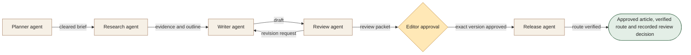

[← All workflows](README.md) · [VYR Agent OS](../../README.md)

# Content Operations

## When good content stalls between research, editing and approval

For marketing teams with a content backlog and a named editor. Bring research, writing and review into one accountable path before publication.

**[Discuss your content bottleneck with VYR →](https://vyrwork.com/contact?utm_source=github&utm_medium=referral&utm_campaign=agent_os_workflows&utm_content=content-operations_top)**

**Status: LIVE.** Live eleven-agent pipeline; new generation is currently paused behind an approval backlog. Status checked 27 September 2026 against [VYR's workflow page](https://vyrwork.com/agent-os/seo-flow?utm_source=github&utm_medium=referral&utm_campaign=agent_os_workflows&utm_content=content-operations_source).

## What the workflow would help you achieve

Prepare a sourced article and release only the version an editor approves.

## How the work moves

Planner checks overlap before commissioning research. Writer consumes the evidence packet; reviewer returns specific revision requests to writer. Only the editor can move an accepted version to release. The diagram groups the published control stages for easier reading.

This is a simplified service illustration. It is not a screenshot or a claim about the exact deployed agent roster.

**Your team stays in control:** A named editor approves, rejects or requests changes before publication.

**Scope boundary:** Backlog pause remains visible; a prepared draft is not a live page or a ranking result.

## A conversation starter

Illustrative scenario: the planner finds that a proposed article overlaps an existing page and holds the draft. After the editor selects a distinct intent, research and writing proceed; a missing source sends the draft back to research before approval.

This example is fictional; it is not a customer result or a promise of measured savings.

## What VYR would scope with you

Your audience, existing content, review owner and publishing system.

VYR reviews the current steps, the integration access available, the human decisions and an observable completion condition. Compatibility, timing and final deliverables are confirmed in the written scope.

## Consider the business case

Estimate the time this process consumes, the review that would remain, and whether freed capacity would avoid a paid cost. [See the ROI and staffing-capacity examples](../../ROI.md).

## Take the next step

**[Discuss your content bottleneck with VYR →](https://vyrwork.com/contact?utm_source=github&utm_medium=referral&utm_campaign=agent_os_workflows&utm_content=content-operations_bottom)**

Prefer a short conversation? [WhatsApp VYR](https://wa.me/6598176520?text=Hi%20VYR%2C%20I%20found%20your%20Content%20Operations%20workflow%20on%20GitHub.%20I%20would%20like%20to%20discuss%20automating%20a%20business%20process.). Tell us which process takes time, the systems involved and the exception your team most often has to resolve.

[Packages and pricing](https://vyrwork.com/pricing?utm_source=github&utm_medium=referral&utm_campaign=agent_os_workflows&utm_content=content-operations_pricing) · [What happens after an enquiry](../../BUYERS_GUIDE.md) · [Explore all 14 workflows](README.md)
