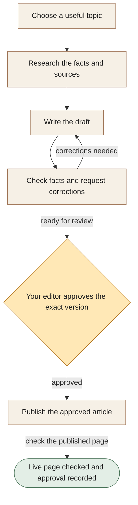

[← All workflows](README.md) · [VYR Agent OS](../../README.md)

# Content Operations

## Get useful content out of the research-and-rewrite loop

See how VYR organises content research, writing and checking before an editor approves publication. New generation in VYR’s live workflow is currently paused while its approval backlog is cleared.

**The business benefit:** Explore a clearer path from an article idea to a checked draft, so your editor spends less time coordinating separate steps.

**Worth discussing if...** content regularly stalls between research, writing, corrections and the person who must approve it.

**[Discuss your content bottleneck →](https://vyrwork.com/contact?utm_source=github&utm_medium=referral&utm_campaign=agent_os_workflows&utm_content=content-operations_top)** · [WhatsApp VYR](https://wa.me/6598176520?text=Hi%20VYR%2C%20I%20found%20your%20Content%20Operations%20example%20on%20GitHub.%20My%20business%3A%20__.%20Tasks%20per%20month%3A%20__.%20Software%20we%20use%3A%20__.%20I%20would%20like%20to%20discuss%20whether%20this%20could%20save%20us%20time%20or%20money.)

**Status: LIVE.** VYR uses eleven specialist software assistants; new generation is currently paused behind an approval backlog. Status checked 27 September 2026 against [VYR's workflow page](https://vyrwork.com/agent-os/seo-flow?utm_source=github&utm_medium=referral&utm_campaign=agent_os_workflows&utm_content=content-operations_source).

## What your team would get

A researched article with its supporting sources and a clear record of the version approved for publication.

## How the assistants work together

AI agents are software assistants with different jobs. A planning assistant checks that the topic adds something useful. A research assistant gathers sources, a writer prepares the draft and a checker asks for corrections. Your editor approves the exact version before it can be published. The diagram groups several specialist jobs into simple steps.

This diagram explains the service in simple steps; it is not a screenshot or an exact system design.

**Your team stays in control:** Your editor can approve, reject or request changes. A draft does not become a published page without approval.

**What to know:** VYR’s content generation is currently paused behind its approval backlog. This example does not promise search rankings or traffic.

**[Explore a simpler research-to-review process →](https://vyrwork.com/contact?utm_source=github&utm_medium=referral&utm_campaign=agent_os_workflows&utm_content=content-operations_flow)**

## Picture it in your business

Illustrative scenario: The planning check finds that a suggested article would repeat an existing page. The editor chooses a more useful angle. Research and writing proceed, but a claim without a source is returned for correction before approval.

This example is fictional, not a client result or a measured saving.

## What we would discuss

Your audience, existing pages, content backlog, editor and publishing software.

You do not need a technical brief. Describe the task in your own words; VYR assesses the software connections, work involved and decisions that stay with your team before confirming a written scope and price.

## Could it be worth the investment?

Start with how often this task happens and how long it takes today. Subtract the checking your team still needs to do. Time saved may reduce paid overtime or avoid a future hire; it becomes a cash saving only when a paid cost is actually avoided. [See the worked savings and payback examples](../../ROI.md).

**[Talk through the content your team wants to publish →](https://vyrwork.com/contact?utm_source=github&utm_medium=referral&utm_campaign=agent_os_workflows&utm_content=content-operations_bottom)** · [Send your brief on WhatsApp](https://wa.me/6598176520?text=Hi%20VYR%2C%20I%20found%20your%20Content%20Operations%20example%20on%20GitHub.%20My%20business%3A%20__.%20Tasks%20per%20month%3A%20__.%20Software%20we%20use%3A%20__.%20I%20would%20like%20to%20discuss%20whether%20this%20could%20save%20us%20time%20or%20money.)

The WhatsApp draft asks for your business, approximate tasks per month and software. Rough figures are enough to start a conversation.

[Packages and pricing](https://vyrwork.com/pricing?utm_source=github&utm_medium=referral&utm_campaign=agent_os_workflows&utm_content=content-operations_pricing) · [What happens after an enquiry](../../BUYERS_GUIDE.md) · [Explore all 14 workflows](README.md) · [Meet Dexter Ng](../../MEET_DEXTER.md)
