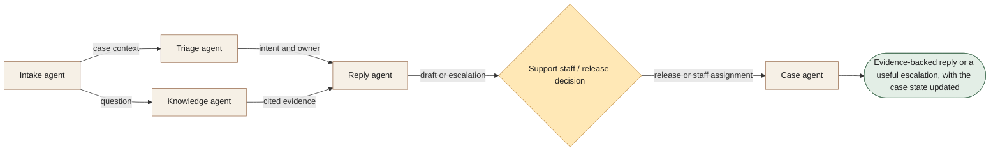

[← All 14 workflows](README.md) · [Guide](../../README.md) · [VYR source](https://vyrwork.com/agent-os/support-flow)

# 07. Customer Support

**BUILT FOR YOU · Checked 27 September 2026**

Build-to-order support triage, grounded replies and controlled release.

> **Goal:** Get each enquiry to a supported answer or the right person with full context.

The role design, worked example and evaluation below are educational proposals. The status and workflow boundary come from the linked VYR page; these role names are not a claim about its exact deployed agent roster.

## Trigger and collaboration

An email, chat or WhatsApp enquiry reaches an approved inbox.

Triage chooses an owner while knowledge retrieves the relevant source. Reply joins those outputs. Missing evidence, complaints, refunds and policy exceptions go to staff before release.

## What each agent passes forward

| Role | Receives | Produces |
|---|---|---|
| Intake agent | Message + permitted account context | Case record and prior-thread summary |
| Triage agent | Case + priority rules | Intent, urgency and queue owner |
| Knowledge agent | Question + approved documentation | Relevant evidence and missing-information flags |
| Reply agent | Evidence + response policy | Grounded draft with cited source |
| Case agent | Release decision or escalation | Sent-message receipt or staff-owned case |

**Human decision:** Support staff own sensitive cases and outbound actions requiring human release.

**Boundary:** No invented policy answers, automatic compensation or bypass of identity checks.

**Done means:** Evidence-backed reply or a useful escalation, with the case state updated.

## Worked example

Fictional run: a delivery question has a clear documented answer, so a draft is prepared. A refund request in the same thread changes the path: staff receive the policy source and customer context before any promise is made.

This is a fictional scenario, not a customer result or a performance claim.

## How to evaluate it

Evaluate grounded-answer accuracy, escalation recall, identity checks and case-state consistency.

Keep a run ID, dated source references, permitted actions, current state, unresolved questions and decision owner with every handoff. Confirm external writes from the receiving system before declaring them complete. See the [build playbook](BUILD_PLAYBOOK.md) for implementation and model-role guidance.

## Artwork

The [image prompt set](IMAGE_PROMPTS.md) includes a dedicated illustration for this workflow. Generation provenance and current asset availability are tracked in [ARTWORK.md](ARTWORK.md).
