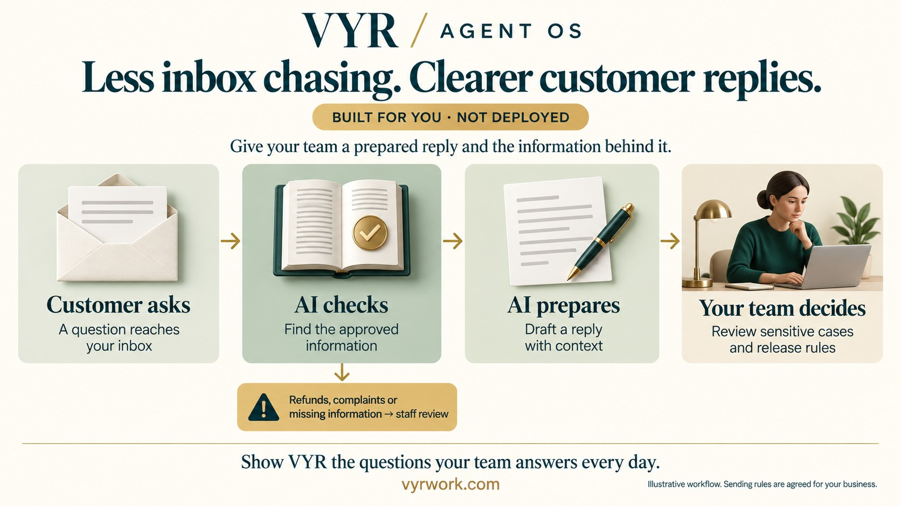
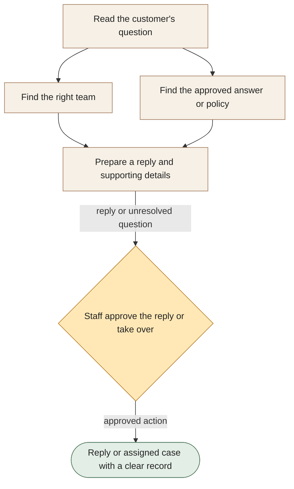

[← All workflows](README.md) · [VYR Agent OS](../../README.md)

# Customer Support

## Give customers a clear answer without passing them around

A proposed support service that gathers the question, finds your approved information and prepares a reply or a useful handover to staff.

**The business benefit:** Aim to reduce repeated searching and forwarding, giving your team more time for complaints and complex customer needs.

**Worth discussing if...** the same questions arrive repeatedly, or staff spend time finding the right policy and the right person to answer.

**[Discuss your most repeated support questions →](https://vyrwork.com/contact?utm_source=github&utm_medium=referral&utm_campaign=agent_os_workflows&utm_content=customer-support_top)** · [WhatsApp VYR](https://wa.me/6598176520?text=Hi%20VYR%2C%20I%20found%20your%20Customer%20Support%20example%20on%20GitHub.%20My%20business%3A%20__.%20Tasks%20per%20month%3A%20__.%20Software%20we%20use%3A%20__.%20I%20would%20like%20to%20discuss%20whether%20this%20could%20save%20us%20time%20or%20money.)

**Status: BUILT FOR YOU.** Custom support sorting, answers based on approved information and staff-controlled release. Status checked 27 September 2026 against [VYR's workflow page](https://vyrwork.com/agent-os/support-flow?utm_source=github&utm_medium=referral&utm_campaign=agent_os_workflows&utm_content=customer-support_source).

## What your team would get

A prepared reply supported by your information, or a clearly assigned case with the customer’s context attached.

## How the assistants work together

AI agents are software assistants with different jobs. One assistant works out who should handle the question while another finds the relevant company information. A reply assistant combines their findings. Staff review the response or take over exceptions before the case is updated.

This diagram explains the service in simple steps; it is not a screenshot or an exact system design.

**Your team stays in control:** Support staff own sensitive cases and any outgoing action that requires their approval.

**What to know:** No invented policy answers, automatic compensation or bypassing identity checks.

**[Explore a clearer path from enquiry to answer →](https://vyrwork.com/contact?utm_source=github&utm_medium=referral&utm_campaign=agent_os_workflows&utm_content=customer-support_flow)**

## Picture it in your business

Illustrative scenario: A delivery question has a clear answer in your policy, so a reply is prepared. The same customer then asks for a refund. Staff receive the policy and conversation before any refund promise is made.

This example is fictional, not a client result or a measured saving.

## What we would discuss

Your support channels, common questions, approved answers, support software and the person who handles difficult cases.

You do not need a technical brief. Describe the task in your own words; VYR assesses the software connections, work involved and decisions that stay with your team before confirming a written scope and price.

## Could it be worth the investment?

Start with how often this task happens and how long it takes today. Subtract the checking your team still needs to do. Time saved may reduce paid overtime or avoid a future hire; it becomes a cash saving only when a paid cost is actually avoided. [See the worked savings and payback examples](../../ROI.md).

**[Find the support tasks worth automating →](https://vyrwork.com/contact?utm_source=github&utm_medium=referral&utm_campaign=agent_os_workflows&utm_content=customer-support_bottom)** · [Send your brief on WhatsApp](https://wa.me/6598176520?text=Hi%20VYR%2C%20I%20found%20your%20Customer%20Support%20example%20on%20GitHub.%20My%20business%3A%20__.%20Tasks%20per%20month%3A%20__.%20Software%20we%20use%3A%20__.%20I%20would%20like%20to%20discuss%20whether%20this%20could%20save%20us%20time%20or%20money.)

The WhatsApp draft asks for your business, approximate tasks per month and software. Rough figures are enough to start a conversation.

[Packages and pricing](https://vyrwork.com/pricing?utm_source=github&utm_medium=referral&utm_campaign=agent_os_workflows&utm_content=customer-support_pricing) · [What happens after an enquiry](../../BUYERS_GUIDE.md) · [Explore all 14 workflows](README.md) · [Meet Dexter Ng](../../MEET_DEXTER.md)
