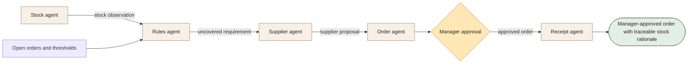

[← All workflows](README.md) · [VYR Agent OS](../../README.md)

# F&B Supplier Reorder

## When stock checks and supplier orders live in separate places

For F&B operators reviewing repeated replenishment decisions. Bring stock signals, open orders and supplier details together for a manager's decision.

**[Discuss supplier reordering with VYR →](https://vyrwork.com/contact?utm_source=github&utm_medium=referral&utm_campaign=agent_os_workflows&utm_content=food-and-beverage_top)**

**Status: BUILT FOR YOU.** Build-to-order operations blueprint; this case focuses on the detailed supplier-reorder path. Status checked 27 September 2026 against [VYR's workflow page](https://vyrwork.com/agent-os/fnb-flow?utm_source=github&utm_medium=referral&utm_campaign=agent_os_workflows&utm_content=food-and-beverage_source).

## What the workflow would help you achieve

Prepare the right stock replenishment for a manager's decision.

## How the work moves

Rules checks both inventory and open orders before supplier planning. The order draft carries assumptions into manager review. Receipt records the authorised release; it does not infer delivery.

This is a simplified service illustration. It is not a screenshot or a claim about the exact deployed agent roster.

**Your team stays in control:** The manager owns supplier, quantity, substitution, price, spending and release.

**Scope boundary:** No unapproved spend or invented substitutions. Delivery remains unconfirmed until evidence arrives.

## A conversation starter

Illustrative scenario: an ingredient appears below threshold, but an open order already covers tomorrow's need. Rules suppresses a duplicate reorder. A different item needs replenishment and proceeds as a manager-review draft.

This example is fictional; it is not a customer result or a promise of measured savings.

## What VYR would scope with you

Your stock source, reorder rules, supplier records and spending approval process.

VYR reviews the current steps, the integration access available, the human decisions and an observable completion condition. Compatibility, timing and final deliverables are confirmed in the written scope.

## Take the next step

**[Discuss supplier reordering with VYR →](https://vyrwork.com/contact?utm_source=github&utm_medium=referral&utm_campaign=agent_os_workflows&utm_content=food-and-beverage_bottom)**

Prefer a short conversation? [WhatsApp VYR](https://wa.me/6598176520?text=Hi%20VYR%2C%20I%20found%20your%20F%26B%20Supplier%20Reorder%20workflow%20on%20GitHub.%20I%20would%20like%20to%20discuss%20automating%20a%20business%20process.). Tell us which process takes time, the systems involved and the exception your team most often has to resolve.

[Packages and pricing](https://vyrwork.com/pricing?utm_source=github&utm_medium=referral&utm_campaign=agent_os_workflows&utm_content=food-and-beverage_pricing) · [What happens after an enquiry](../../BUYERS_GUIDE.md) · [Explore all 14 workflows](README.md)
