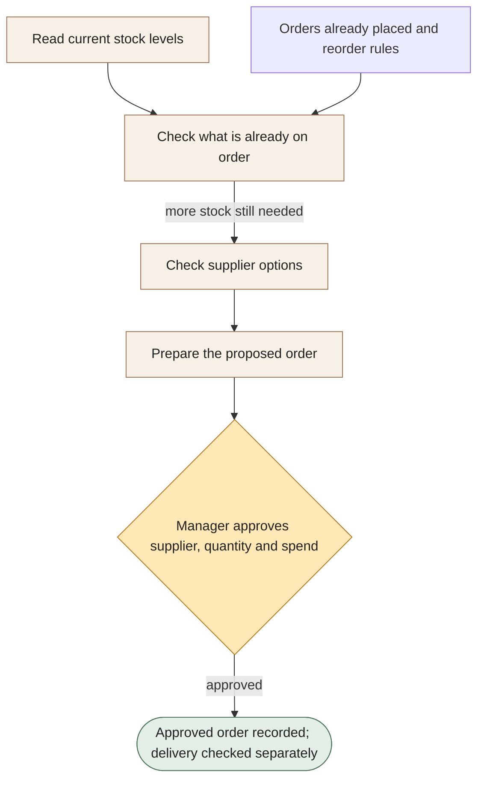

[← All workflows](README.md) · [VYR Agent OS](../../README.md)

# F&B Supplier Reorder

## Make stock ordering easier to check before money is spent

A proposed service that brings stock levels, orders already placed and supplier details together before your manager approves a reorder.

**The business benefit:** Aim to reduce repeated stock checking and make possible duplicate orders visible before approval.

**Worth discussing if...** managers regularly compare stock records, supplier messages and open orders by hand.

**[Discuss simpler supplier ordering →](https://vyrwork.com/contact?utm_source=github&utm_medium=referral&utm_campaign=agent_os_workflows&utm_content=food-and-beverage_top)** · [WhatsApp VYR](https://wa.me/6598176520?text=Hi%20VYR%2C%20I%20found%20your%20F%26B%20Supplier%20Reorder%20example%20on%20GitHub.%20My%20business%3A%20__.%20Tasks%20per%20month%3A%20__.%20Software%20we%20use%3A%20__.%20I%20would%20like%20to%20discuss%20whether%20this%20could%20save%20us%20time%20or%20money.)

**Status: BUILT FOR YOU.** Build-to-order operations blueprint; this case focuses on the detailed supplier-reorder path. Status checked 27 September 2026 against [VYR's workflow page](https://vyrwork.com/agent-os/fnb-flow?utm_source=github&utm_medium=referral&utm_campaign=agent_os_workflows&utm_content=food-and-beverage_source).

## What your team would get

A proposed order with the quantities, supplier and reason for ordering ready for a manager to check.

## How the assistants work together

AI agents are software assistants with different jobs. A stock assistant spots a possible shortage. A checker compares it with orders already on the way. A supplier assistant prepares options, and an order assistant creates a draft for the manager. The approved action is recorded separately from proof of delivery.

This diagram explains the service in simple steps; it is not a screenshot or an exact system design.

**Your team stays in control:** The manager decides the supplier, quantity, substitutions, price, spending and release of the order.

**What to know:** No unapproved spending or invented substitutions. An order being placed does not mean it has been delivered.

**[Show us how your team checks stock and orders →](https://vyrwork.com/contact?utm_source=github&utm_medium=referral&utm_campaign=agent_os_workflows&utm_content=food-and-beverage_flow)**

## Picture it in your business

Illustrative scenario: An ingredient looks low, but an existing order already covers tomorrow’s need. The checker avoids proposing the same order again. A different item still needs replenishing, so a draft goes to the manager.

This example is fictional, not a client result or a measured saving.

## What we would discuss

Your stock records, reorder rules, supplier details and purchasing approval process.

You do not need a technical brief. Describe the task in your own words; VYR assesses the software connections, work involved and decisions that stay with your team before confirming a written scope and price.

## Could it be worth the investment?

Start with how often this task happens and how long it takes today. Subtract the checking your team still needs to do. Time saved may reduce paid overtime or avoid a future hire; it becomes a cash saving only when a paid cost is actually avoided. [See the worked savings and payback examples](../../ROI.md).

**[Explore a reorder process your manager can review →](https://vyrwork.com/contact?utm_source=github&utm_medium=referral&utm_campaign=agent_os_workflows&utm_content=food-and-beverage_bottom)** · [Send your brief on WhatsApp](https://wa.me/6598176520?text=Hi%20VYR%2C%20I%20found%20your%20F%26B%20Supplier%20Reorder%20example%20on%20GitHub.%20My%20business%3A%20__.%20Tasks%20per%20month%3A%20__.%20Software%20we%20use%3A%20__.%20I%20would%20like%20to%20discuss%20whether%20this%20could%20save%20us%20time%20or%20money.)

The WhatsApp draft asks for your business, approximate tasks per month and software. Rough figures are enough to start a conversation.

[Packages and pricing](https://vyrwork.com/pricing?utm_source=github&utm_medium=referral&utm_campaign=agent_os_workflows&utm_content=food-and-beverage_pricing) · [What happens after an enquiry](../../BUYERS_GUIDE.md) · [Explore all 14 workflows](README.md) · [Meet Dexter Ng](../../MEET_DEXTER.md)
