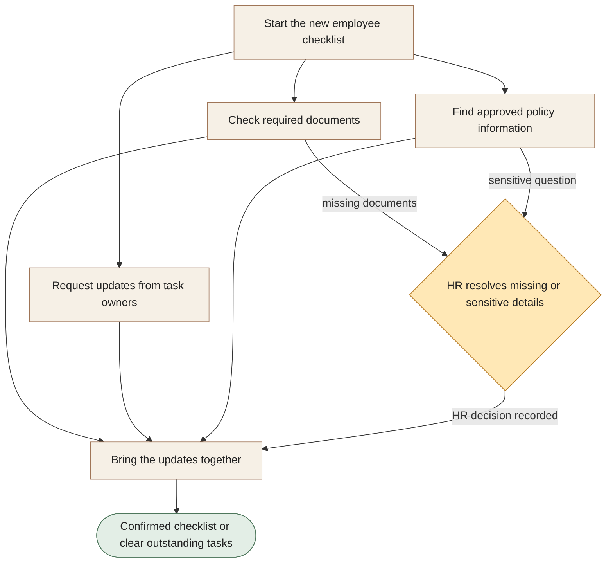

[← All workflows](README.md) · [VYR Agent OS](../../README.md)

# HR Operations

## Know what is ready before a new employee starts

A proposed onboarding service that keeps documents, equipment, system access and manager tasks in one clear checklist.

**The business benefit:** Aim to reduce HR’s time spent chasing updates and make unfinished tasks visible before someone’s first day.

**Worth discussing if...** each new starter involves several people and HR has to repeatedly ask what has been completed.

**[Discuss a clearer onboarding checklist →](https://vyrwork.com/contact?utm_source=github&utm_medium=referral&utm_campaign=agent_os_workflows&utm_content=hr-operations_top)** · [WhatsApp VYR](https://wa.me/6598176520?text=Hi%20VYR%2C%20I%20found%20your%20HR%20Operations%20example%20on%20GitHub.%20My%20business%3A%20__.%20Tasks%20per%20month%3A%20__.%20Software%20we%20use%3A%20__.%20I%20would%20like%20to%20discuss%20whether%20this%20could%20save%20us%20time%20or%20money.)

**Status: BUILT FOR YOU.** Custom onboarding and policy support; compatibility with Talenox or Payboy needs scoping and testing. Status checked 27 September 2026 against [VYR's workflow page](https://vyrwork.com/agent-os/hr-flow?utm_source=github&utm_medium=referral&utm_campaign=agent_os_workflows&utm_content=hr-operations_source).

## What your team would get

An onboarding checklist that shows what is complete, what is still missing and who is responsible.

## How the assistants work together

AI agents are software assistants with different jobs. A coordinating assistant sends work to document, task and policy assistants. They return confirmations and unanswered questions. A final checker keeps the list open until the required work is confirmed, while HR handles sensitive decisions.

This diagram explains the service in simple steps; it is not a screenshot or an exact system design.

**Your team stays in control:** HR resolves missing information and sensitive situations, and retains all employment decisions.

**What to know:** No independent decisions about salary, payroll, performance, discipline or termination. Assigning a task does not count as completing it.

**[Show us what HR keeps having to chase →](https://vyrwork.com/contact?utm_source=github&utm_medium=referral&utm_campaign=agent_os_workflows&utm_content=hr-operations_flow)**

## Picture it in your business

Illustrative scenario: A new starter has submitted the documents, but IT has not confirmed their system access. The checklist stays open and identifies IT as the owner. An unusual employment-term question goes to HR.

This example is fictional, not a client result or a measured saving.

## What we would discuss

Your onboarding checklist, HR software, people responsible for each task and the situations that need HR’s decision.

You do not need a technical brief. Describe the task in your own words; VYR assesses the software connections, work involved and decisions that stay with your team before confirming a written scope and price.

## Could it be worth the investment?

Start with how often this task happens and how long it takes today. Subtract the checking your team still needs to do. Time saved may reduce paid overtime or avoid a future hire; it becomes a cash saving only when a paid cost is actually avoided. [See the worked savings and payback examples](../../ROI.md).

**[Explore onboarding help for your team →](https://vyrwork.com/contact?utm_source=github&utm_medium=referral&utm_campaign=agent_os_workflows&utm_content=hr-operations_bottom)** · [Send your brief on WhatsApp](https://wa.me/6598176520?text=Hi%20VYR%2C%20I%20found%20your%20HR%20Operations%20example%20on%20GitHub.%20My%20business%3A%20__.%20Tasks%20per%20month%3A%20__.%20Software%20we%20use%3A%20__.%20I%20would%20like%20to%20discuss%20whether%20this%20could%20save%20us%20time%20or%20money.)

The WhatsApp draft asks for your business, approximate tasks per month and software. Rough figures are enough to start a conversation.

[Packages and pricing](https://vyrwork.com/pricing?utm_source=github&utm_medium=referral&utm_campaign=agent_os_workflows&utm_content=hr-operations_pricing) · [What happens after an enquiry](../../BUYERS_GUIDE.md) · [Explore all 14 workflows](README.md) · [Meet Dexter Ng](../../MEET_DEXTER.md)
