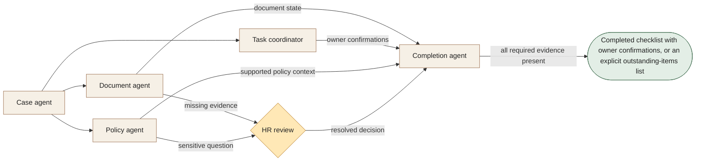

[← All 14 workflows](README.md) · [Guide](../../README.md) · [VYR source](https://vyrwork.com/agent-os/hr-flow)

# 08. HR Operations

**BUILT FOR YOU · Checked 27 September 2026**

Build-to-order onboarding and policy routing; Talenox or Payboy integration is scoped and tested.

> **Goal:** Make a new starter's onboarding complete, attributable and reviewable.

The role design, worked example and evaluation below are educational proposals. The status and workflow boundary come from the linked VYR page; these role names are not a claim about its exact deployed agent roster.

## Trigger and collaboration

HR approves a role, start date and onboarding owner.

The case agent fans work out to documents, task coordination and policy support. Completion joins their evidence; assigned tasks do not count as completed tasks.

## What each agent passes forward

| Role | Receives | Produces |
|---|---|---|
| Case agent | Approved starter brief | Role-specific onboarding checklist |
| Document agent | Checklist + submitted documents | Required-document status and gaps |
| Task coordinator | Checklist + named owners | Equipment, access and manager tasks |
| Policy agent | Employee question + approved policies | Supported answer draft or HR referral |
| Completion agent | Owner confirmations + HR decisions | Verified onboarding state |

**Human decision:** HR resolves missing evidence and sensitive exceptions, and retains all employment decisions.

**Boundary:** No autonomous salary, payroll, performance, discipline or termination decisions.

**Done means:** Completed checklist with owner confirmations, or an explicit outstanding-items list.

## Worked example

Fictional run: a new starter has supplied the required documents, but IT has not confirmed access. Completion leaves onboarding open and identifies IT as the owner. An unusual employment-term question goes to HR.

This is a fictional scenario, not a customer result or a performance claim.

## How to evaluate it

Track overdue ownership, falsely completed tasks, document-access boundaries and policy-source coverage.

Keep a run ID, dated source references, permitted actions, current state, unresolved questions and decision owner with every handoff. Confirm external writes from the receiving system before declaring them complete. See the [build playbook](BUILD_PLAYBOOK.md) for implementation and model-role guidance.

## Artwork

The [image prompt set](IMAGE_PROMPTS.md) includes a dedicated illustration for this workflow. Generation provenance and current asset availability are tracked in [ARTWORK.md](ARTWORK.md).
