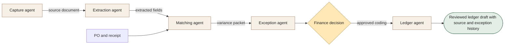

[← All 14 workflows](README.md) · [Guide](../../README.md) · [VYR source](https://vyrwork.com/agent-os/invoice-flow)

# 06. Invoice Processing

**BUILT FOR YOU · Checked 27 September 2026**

Build-to-order invoice review and Xero draft integration; payment authority stays with finance.

> **Goal:** Convert an invoice into a reviewed accounting draft with explainable exceptions.

The role design, worked example and evaluation below are educational proposals. The status and workflow boundary come from the linked VYR page; these role names are not a claim about its exact deployed agent roster.

## Trigger and collaboration

A supplier invoice arrives as an approved attachment or scan.

Extraction attaches each field to its source. Matching compares independent records. Exceptions travel with the conflicting values, so finance can resolve them before the ledger agent prepares an approved draft.

## What each agent passes forward

| Role | Receives | Produces |
|---|---|---|
| Capture agent | Invoice + original source | Source-preserved document record |
| Extraction agent | Document record | Supplier, amount, tax and line-item fields |
| Matching agent | Extracted fields + PO + receipt | Variance and possible-duplicate report |
| Exception agent | Mismatches + finance rules | Finance review packet |
| Ledger agent | Finance-approved coding | Draft Xero entry and integration receipt |

**Human decision:** Finance resolves mismatches and retains accounting decisions and payment authority.

**Boundary:** No bank access or automatic payment. Extraction confidence does not establish invoice validity.

**Done means:** Reviewed ledger draft with source and exception history.

## Worked example

Fictional run: an invoice lists 12 units but the receipt records 10. Matching passes both figures to finance. The draft remains held until the discrepancy is resolved; approval creates an accounting draft, never a bank transfer.

This is a fictional scenario, not a customer result or a performance claim.

## How to evaluate it

Test duplicate handling, arithmetic reconciliation, field-source traceability and exception routing.

Keep a run ID, dated source references, permitted actions, current state, unresolved questions and decision owner with every handoff. Confirm external writes from the receiving system before declaring them complete. See the [build playbook](BUILD_PLAYBOOK.md) for implementation and model-role guidance.

## Artwork

The [image prompt set](IMAGE_PROMPTS.md) includes a dedicated illustration for this workflow. Generation provenance and current asset availability are tracked in [ARTWORK.md](ARTWORK.md).
