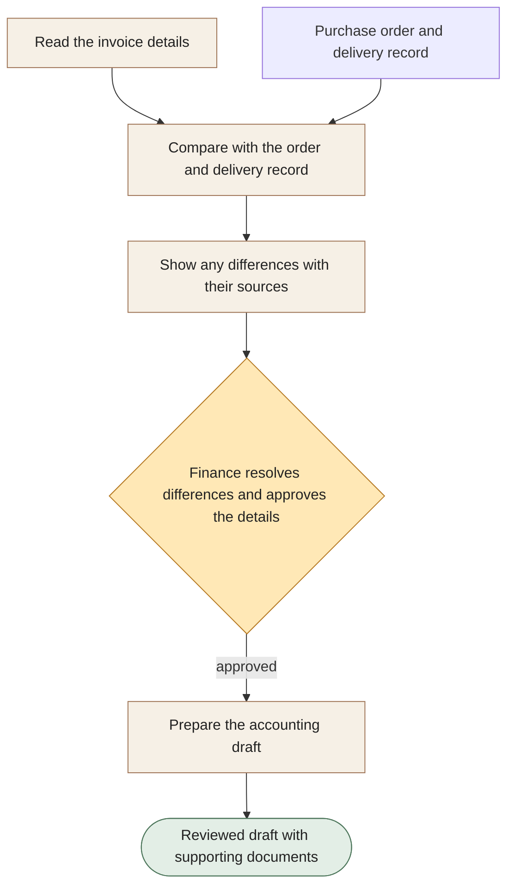

[← All workflows](README.md) · [VYR Agent OS](../../README.md)

# Invoice Processing

## Give finance fewer documents to chase and fewer details to retype

A proposed service that reads invoice details, compares them with your purchase and delivery records, and prepares a draft for finance to review.

**The business benefit:** Aim to reduce manual copying and checking while bringing mismatches to the person who can resolve them.

**Worth discussing if...** your team processes invoices repeatedly and spends time checking quantities, prices and supporting documents.

**[Discuss the time your invoices take →](https://vyrwork.com/contact?utm_source=github&utm_medium=referral&utm_campaign=agent_os_workflows&utm_content=invoice-processing_top)** · [WhatsApp VYR](https://wa.me/6598176520?text=Hi%20VYR%2C%20I%20found%20your%20Invoice%20Processing%20example%20on%20GitHub.%20My%20business%3A%20__.%20Tasks%20per%20month%3A%20__.%20Software%20we%20use%3A%20__.%20I%20would%20like%20to%20discuss%20whether%20this%20could%20save%20us%20time%20or%20money.)

**Status: BUILT FOR YOU.** Custom invoice review and draft entries in Xero; payment authority stays with finance. Status checked 27 September 2026 against [VYR's workflow page](https://vyrwork.com/agent-os/invoice-flow?utm_source=github&utm_medium=referral&utm_campaign=agent_os_workflows&utm_content=invoice-processing_source).

## What your team would get

A draft entry for your accounting software, with the original invoice and any unresolved differences easy to find.

## How the assistants work together

AI agents are software assistants with different jobs. One assistant reads the invoice. Another checks it against the purchase order and delivery record. A third collects differences for finance to resolve. Only then does the accounting assistant prepare the approved draft.

This diagram explains the service in simple steps; it is not a screenshot or an exact system design.

**Your team stays in control:** Finance decides how to resolve mismatches, how entries are recorded and whether any payment is made.

**What to know:** No bank access or automatic payment. Reading an invoice accurately does not prove the invoice is valid.

**[Explore a simpler invoice-to-review process →](https://vyrwork.com/contact?utm_source=github&utm_medium=referral&utm_campaign=agent_os_workflows&utm_content=invoice-processing_flow)**

## Picture it in your business

Illustrative scenario: An invoice lists 12 units, but the delivery record shows 10. Both figures go to finance with their source documents. The draft stays on hold until the difference is resolved. Approval creates an accounting draft, never a bank transfer.

This example is fictional, not a client result or a measured saving.

## What we would discuss

Your invoice sources, purchase orders, delivery records and accounting software.

You do not need a technical brief. Describe the task in your own words; VYR assesses the software connections, work involved and decisions that stay with your team before confirming a written scope and price.

## Could it be worth the investment?

Start with how often this task happens and how long it takes today. Subtract the checking your team still needs to do. Time saved may reduce paid overtime or avoid a future hire; it becomes a cash saving only when a paid cost is actually avoided. [See the worked savings and payback examples](../../ROI.md).

**[Assess whether invoice automation could pay off →](https://vyrwork.com/contact?utm_source=github&utm_medium=referral&utm_campaign=agent_os_workflows&utm_content=invoice-processing_bottom)** · [Send your brief on WhatsApp](https://wa.me/6598176520?text=Hi%20VYR%2C%20I%20found%20your%20Invoice%20Processing%20example%20on%20GitHub.%20My%20business%3A%20__.%20Tasks%20per%20month%3A%20__.%20Software%20we%20use%3A%20__.%20I%20would%20like%20to%20discuss%20whether%20this%20could%20save%20us%20time%20or%20money.)

The WhatsApp draft asks for your business, approximate tasks per month and software. Rough figures are enough to start a conversation.

[Packages and pricing](https://vyrwork.com/pricing?utm_source=github&utm_medium=referral&utm_campaign=agent_os_workflows&utm_content=invoice-processing_pricing) · [What happens after an enquiry](../../BUYERS_GUIDE.md) · [Explore all 14 workflows](README.md) · [Meet Dexter Ng](../../MEET_DEXTER.md)
