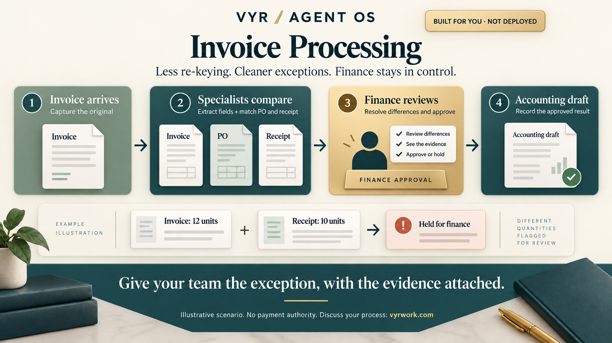

[← All workflows](README.md) · [VYR Agent OS](../../README.md)

# Invoice Processing

## When invoices arrive faster than finance can reconcile them

For finance teams handling repeated invoice capture, matching and exception review. Give finance a source-backed exception packet before an approved accounting draft is prepared.

**[Discuss your invoice process with VYR →](https://vyrwork.com/contact?utm_source=github&utm_medium=referral&utm_campaign=agent_os_workflows&utm_content=invoice-processing_top)**

**Status: BUILT FOR YOU.** Build-to-order invoice review and Xero draft integration; payment authority stays with finance. Status checked 27 September 2026 against [VYR's workflow page](https://vyrwork.com/agent-os/invoice-flow?utm_source=github&utm_medium=referral&utm_campaign=agent_os_workflows&utm_content=invoice-processing_source).

## What the workflow would help you achieve

Convert an invoice into a reviewed accounting draft with explainable exceptions.

## How the work moves

Extraction attaches each field to its source. Matching compares independent records. Exceptions travel with the conflicting values, so finance can resolve them before the ledger agent prepares an approved draft.

This is a simplified service illustration. It is not a screenshot or a claim about the exact deployed agent roster.

**Your team stays in control:** Finance resolves mismatches and retains accounting decisions and payment authority.

**Scope boundary:** No bank access or automatic payment. Extraction confidence does not establish invoice validity.

## A conversation starter

Illustrative scenario: an invoice lists 12 units but the receipt records 10. Matching passes both figures to finance. The draft remains held until the discrepancy is resolved; approval creates an accounting draft, never a bank transfer.

This example is fictional; it is not a customer result or a promise of measured savings.

## What VYR would scope with you

Your invoice sources, purchase-order records, receipt evidence and accounting system.

VYR reviews the current steps, the integration access available, the human decisions and an observable completion condition. Compatibility, timing and final deliverables are confirmed in the written scope.

## Consider the business case

Estimate the time this process consumes, the review that would remain, and whether freed capacity would avoid a paid cost. [See the ROI and staffing-capacity examples](../../ROI.md).

## Take the next step

**[Discuss your invoice process with VYR →](https://vyrwork.com/contact?utm_source=github&utm_medium=referral&utm_campaign=agent_os_workflows&utm_content=invoice-processing_bottom)**

Prefer a short conversation? [WhatsApp VYR](https://wa.me/6598176520?text=Hi%20VYR%2C%20I%20found%20your%20Invoice%20Processing%20workflow%20on%20GitHub.%20I%20would%20like%20to%20discuss%20automating%20a%20business%20process.). Tell us which process takes time, the systems involved and the exception your team most often has to resolve.

[Packages and pricing](https://vyrwork.com/pricing?utm_source=github&utm_medium=referral&utm_campaign=agent_os_workflows&utm_content=invoice-processing_pricing) · [What happens after an enquiry](../../BUYERS_GUIDE.md) · [Explore all 14 workflows](README.md)
