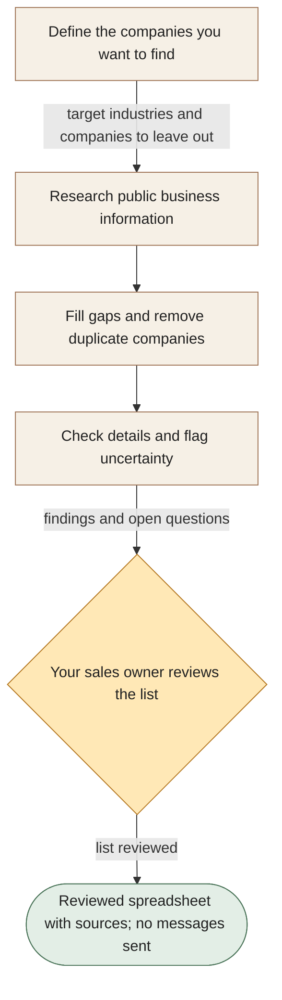

[← All workflows](README.md) · [VYR Agent OS](../../README.md)

# Prospect Research

## Give sales more time for conversations and less time building lists

See how VYR’s live research service gathers public business information, removes duplicates and flags details that still need checking.

**The business benefit:** Explore how preparing a clearer company list could reduce manual research before your sales team decides whom to approach.

**Worth discussing if...** your team can describe its ideal customer but spends recurring time finding and checking company information.

**[Discuss the customers you want to research →](https://vyrwork.com/contact?utm_source=github&utm_medium=referral&utm_campaign=agent_os_workflows&utm_content=lead-generation_top)** · [WhatsApp VYR](https://wa.me/6598176520?text=Hi%20VYR%2C%20I%20found%20your%20Prospect%20Research%20example%20on%20GitHub.%20My%20business%3A%20__.%20Tasks%20per%20month%3A%20__.%20Software%20we%20use%3A%20__.%20I%20would%20like%20to%20discuss%20whether%20this%20could%20save%20us%20time%20or%20money.)

**Status: LIVE.** Public business research, missing-detail checks, duplicate removal and email checks within VYR; no outreach is sent. Status checked 27 September 2026 against [VYR's workflow page](https://vyrwork.com/agent-os/leadgen-flow?utm_source=github&utm_medium=referral&utm_campaign=agent_os_workflows&utm_content=lead-generation_source).

Illustrated service flow; company names and cards in the artwork are fictional.

## What your team would get

A spreadsheet of researched companies, with sources and uncertainties visible for your sales team to review.

## How the assistants work together

AI agents are software assistants with different jobs. A briefing assistant starts with your target customer. A research assistant finds companies, another fills in missing details and a checker removes duplicates and flags uncertain information. Your sales owner reviews the list before it is delivered.

This diagram explains the service in simple steps; it is not a screenshot or an exact system design.

**Your team stays in control:** Your sales team decides whether a company is suitable, how to use the list and whether any later contact is appropriate.

**What to know:** The workflow sends no outreach. An email check does not prove consent, buyer interest or guaranteed delivery. Researched companies are not confirmed sales leads.

**[Explore a better-prepared prospect list →](https://vyrwork.com/contact?utm_source=github&utm_medium=referral&utm_campaign=agent_os_workflows&utm_content=lead-generation_flow)**

## Picture it in your business

Illustrative scenario: Your brief asks for Singapore wholesalers. Research finds possible companies and removes one already on a previous list. An uncertain email address stays flagged. The reviewed list is delivered without sending any messages.

This example is fictional, not a client result or a measured saving.

## What we would discuss

Your target industries, locations, companies to exclude and what makes a company worth your sales team’s attention.

You do not need a technical brief. Describe the task in your own words; VYR assesses the software connections, work involved and decisions that stay with your team before confirming a written scope and price.

## Could it be worth the investment?

Start with how often this task happens and how long it takes today. Subtract the checking your team still needs to do. Time saved may reduce paid overtime or avoid a future hire; it becomes a cash saving only when a paid cost is actually avoided. [See the worked savings and payback examples](../../ROI.md).

**[Talk through your sales research workload →](https://vyrwork.com/contact?utm_source=github&utm_medium=referral&utm_campaign=agent_os_workflows&utm_content=lead-generation_bottom)** · [Send your brief on WhatsApp](https://wa.me/6598176520?text=Hi%20VYR%2C%20I%20found%20your%20Prospect%20Research%20example%20on%20GitHub.%20My%20business%3A%20__.%20Tasks%20per%20month%3A%20__.%20Software%20we%20use%3A%20__.%20I%20would%20like%20to%20discuss%20whether%20this%20could%20save%20us%20time%20or%20money.)

The WhatsApp draft asks for your business, approximate tasks per month and software. Rough figures are enough to start a conversation.

[Packages and pricing](https://vyrwork.com/pricing?utm_source=github&utm_medium=referral&utm_campaign=agent_os_workflows&utm_content=lead-generation_pricing) · [What happens after an enquiry](../../BUYERS_GUIDE.md) · [Explore all 14 workflows](README.md) · [Meet Dexter Ng](../../MEET_DEXTER.md)
