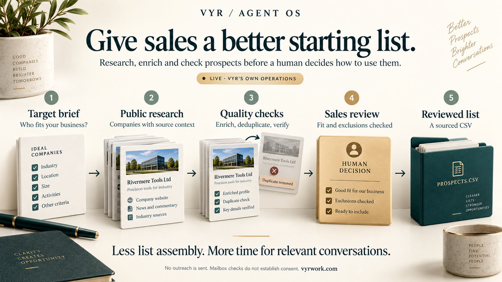

[← All workflows](README.md) · [VYR Agent OS](../../README.md)

# Lead Generation

Illustrated service flow; company names and cards in the artwork are fictional.

## When sales spends too much time assembling prospect lists

For B2B teams with a clear target customer and an owner who reviews list quality. Review prospect records with business sources, duplicate checks and contact-check context.

**[Discuss a prospect research workflow with VYR →](https://vyrwork.com/contact?utm_source=github&utm_medium=referral&utm_campaign=agent_os_workflows&utm_content=lead-generation_top)**

**Status: LIVE.** Public-source prospect research, enrichment, deduplication and mailbox checks; outreach is excluded. Status checked 27 September 2026 against [VYR's workflow page](https://vyrwork.com/agent-os/leadgen-flow?utm_source=github&utm_medium=referral&utm_campaign=agent_os_workflows&utm_content=lead-generation_source).

## What the workflow would help you achieve

Deliver a sourced prospect list that a sales owner can review.

## How the work moves

Research passes candidate records to enrichment. Verification annotates surviving records rather than replacing their evidence. Sales reviews fit and exclusions before delivery exports the list.

This is a simplified service illustration. It is not a screenshot or a claim about the exact deployed agent roster.

**Your team stays in control:** Sales owns suitability, list use and every subsequent outreach decision.

**Scope boundary:** Mailbox verification does not prove consent, buyer interest or guaranteed delivery. No messages are sent.

## A conversation starter

Illustrative scenario: a Singapore wholesale brief yields candidate companies. An already-delivered company is removed. One uncertain mailbox stays flagged for review; it is never relabelled as a willing buyer. The accepted list is exported without sending outreach.

This example is fictional; it is not a customer result or a promise of measured savings.

## What VYR would scope with you

Your target industries, geography, exclusions and definition of a useful prospect.

VYR reviews the current steps, the integration access available, the human decisions and an observable completion condition. Compatibility, timing and final deliverables are confirmed in the written scope.

## Consider the business case

Estimate the time this process consumes, the review that would remain, and whether freed capacity would avoid a paid cost. [See the ROI and staffing-capacity examples](../../ROI.md).

## Take the next step

**[Discuss a prospect research workflow with VYR →](https://vyrwork.com/contact?utm_source=github&utm_medium=referral&utm_campaign=agent_os_workflows&utm_content=lead-generation_bottom)**

Prefer a short conversation? [WhatsApp VYR](https://wa.me/6598176520?text=Hi%20VYR%2C%20I%20found%20your%20Lead%20Generation%20workflow%20on%20GitHub.%20I%20would%20like%20to%20discuss%20automating%20a%20business%20process.). Tell us which process takes time, the systems involved and the exception your team most often has to resolve.

[Packages and pricing](https://vyrwork.com/pricing?utm_source=github&utm_medium=referral&utm_campaign=agent_os_workflows&utm_content=lead-generation_pricing) · [What happens after an enquiry](../../BUYERS_GUIDE.md) · [Explore all 14 workflows](README.md)
