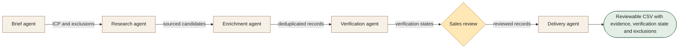

[← All 14 workflows](README.md) · [Guide](../../README.md) · [VYR source](https://vyrwork.com/agent-os/leadgen-flow)

# 03. Lead Generation

**LIVE · Checked 27 September 2026**

Public-source prospect research, enrichment, deduplication and mailbox checks; outreach is excluded.

> **Goal:** Deliver a sourced prospect list that a sales owner can review.

The role design, worked example and evaluation below are educational proposals. The status and workflow boundary come from the linked VYR page; these role names are not a claim about its exact deployed agent roster.

## Trigger and collaboration

Sales supplies an ideal-customer profile and exclusion list.

Research passes candidate records to enrichment. Verification annotates surviving records rather than replacing their evidence. Sales reviews fit and exclusions before delivery exports the list.

## What each agent passes forward

| Role | Receives | Produces |
|---|---|---|
| Brief agent | Approved ICP + exclusions | Search criteria and required evidence |
| Research agent | Criteria + public business sources | Candidate companies with source URLs |
| Enrichment agent | Candidates + prior-record inventory | Business context and duplicate decisions |
| Verification agent | Candidate contact fields | Mailbox-check status with uncertainty |
| Delivery agent | Sales-reviewed records | Scored CSV and source context |

**Human decision:** Sales owns suitability, list use and every subsequent outreach decision.

**Boundary:** Mailbox verification does not prove consent, buyer interest or guaranteed delivery. No messages are sent.

**Done means:** Reviewable CSV with evidence, verification state and exclusions.

## Worked example

Fictional run: a Singapore wholesale brief yields candidate companies. An already-delivered company is removed. One uncertain mailbox stays flagged for review; it is never relabelled as a willing buyer. The accepted list is exported without sending outreach.

This is a fictional scenario, not a customer result or a performance claim.

## How to evaluate it

Measure duplicate rate, source coverage, review acceptance and contact-check freshness.

Keep a run ID, dated source references, permitted actions, current state, unresolved questions and decision owner with every handoff. Confirm external writes from the receiving system before declaring them complete. See the [build playbook](BUILD_PLAYBOOK.md) for implementation and model-role guidance.

## Artwork

The [image prompt set](IMAGE_PROMPTS.md) includes a dedicated illustration for this workflow. Generation provenance and current asset availability are tracked in [ARTWORK.md](ARTWORK.md).
