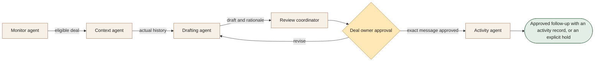

[← All workflows](README.md) · [VYR Agent OS](../../README.md)

# Lead Nurture

## When follow-ups depend on someone remembering a stalled deal

For sales teams with usable HubSpot records and an accountable deal owner. Prepare a relevant next contact from actual deal history for the owner's decision.

**[Discuss your follow-up process with VYR →](https://vyrwork.com/contact?utm_source=github&utm_medium=referral&utm_campaign=agent_os_workflows&utm_content=lead-nurture_top)**

**Status: BUILT FOR YOU.** Build-to-order HubSpot follow-up workflow; there is no claimed live client deployment. Status checked 27 September 2026 against [VYR's workflow page](https://vyrwork.com/agent-os/nurture-flow?utm_source=github&utm_medium=referral&utm_campaign=agent_os_workflows&utm_content=lead-nurture_source).

## What the workflow would help you achieve

Prepare a relevant next contact for the deal owner's approval.

## How the work moves

Monitor selects eligible cases; context checks the actual history before drafting. The owner edits or rejects the proposal. Activity runs only after the approved release condition is satisfied.

This is a simplified service illustration. It is not a screenshot or a claim about the exact deployed agent roster.

**Your team stays in control:** The sales owner controls recipient, copy, timing and send.

**Scope boundary:** A CRM record alone is not contact permission. Do not fabricate relationship history.

## A conversation starter

Illustrative scenario: a proposal has been inactive for a week. Context finds a note that the buyer is away; the draft proposes waiting. The owner sets an appropriate date, and only the approved message becomes a send task.

This example is fictional; it is not a customer result or a promise of measured savings.

## What VYR would scope with you

Your deal stages, inactivity rules, contact policy and approval owners.

VYR reviews the current steps, the integration access available, the human decisions and an observable completion condition. Compatibility, timing and final deliverables are confirmed in the written scope.

## Consider the business case

Estimate the time this process consumes, the review that would remain, and whether freed capacity would avoid a paid cost. [See the ROI and staffing-capacity examples](../../ROI.md).

## Take the next step

**[Discuss your follow-up process with VYR →](https://vyrwork.com/contact?utm_source=github&utm_medium=referral&utm_campaign=agent_os_workflows&utm_content=lead-nurture_bottom)**

Prefer a short conversation? [WhatsApp VYR](https://wa.me/6598176520?text=Hi%20VYR%2C%20I%20found%20your%20Lead%20Nurture%20workflow%20on%20GitHub.%20I%20would%20like%20to%20discuss%20automating%20a%20business%20process.). Tell us which process takes time, the systems involved and the exception your team most often has to resolve.

[Packages and pricing](https://vyrwork.com/pricing?utm_source=github&utm_medium=referral&utm_campaign=agent_os_workflows&utm_content=lead-nurture_pricing) · [What happens after an enquiry](../../BUYERS_GUIDE.md) · [Explore all 14 workflows](README.md)
