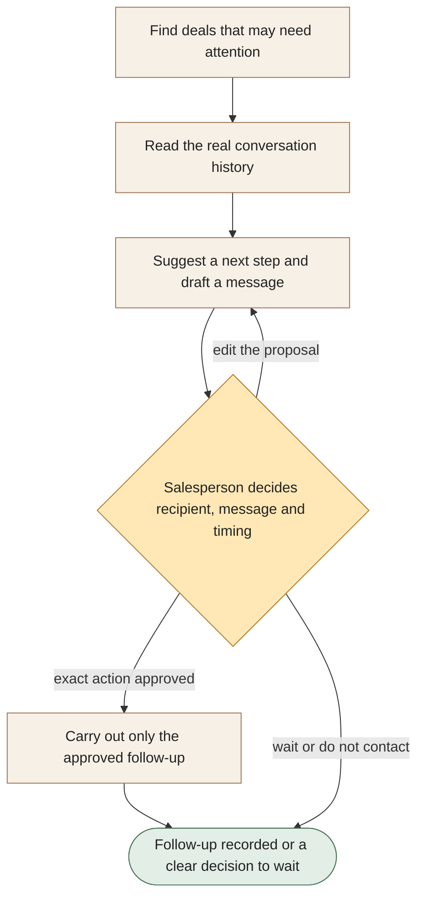

[← All workflows](README.md) · [VYR Agent OS](../../README.md)

# Lead Nurture

## Keep promising conversations from disappearing into the to-do list

A proposed HubSpot service that reviews deal history and prepares a relevant follow-up for the salesperson to approve.

**The business benefit:** Aim to reduce the effort of reviewing quiet deals and drafting the next message, while your team stays in charge of the relationship.

**Worth discussing if...** follow-ups rely on someone remembering each deal, and your team keeps usable notes in HubSpot.

**[Discuss the follow-ups your team keeps chasing →](https://vyrwork.com/contact?utm_source=github&utm_medium=referral&utm_campaign=agent_os_workflows&utm_content=lead-nurture_top)** · [WhatsApp VYR](https://wa.me/6598176520?text=Hi%20VYR%2C%20I%20found%20your%20Lead%20Nurture%20example%20on%20GitHub.%20My%20business%3A%20__.%20Tasks%20per%20month%3A%20__.%20Software%20we%20use%3A%20__.%20I%20would%20like%20to%20discuss%20whether%20this%20could%20save%20us%20time%20or%20money.)

**Status: BUILT FOR YOU.** Build-to-order HubSpot follow-up workflow; there is no claimed live client deployment. Status checked 27 September 2026 against [VYR's workflow page](https://vyrwork.com/agent-os/nurture-flow?utm_source=github&utm_medium=referral&utm_campaign=agent_os_workflows&utm_content=lead-nurture_source).

## What your team would get

A suggested next step and message based on the actual conversation, ready for the deal owner’s decision.

## How the assistants work together

AI agents are software assistants with different jobs. One assistant finds deals that may need attention. Another checks their history before a writing assistant prepares a message or recommends waiting. The salesperson can edit, approve or hold it. Only approved actions are recorded and carried forward.

This diagram explains the service in simple steps; it is not a screenshot or an exact system design.

**Your team stays in control:** The salesperson controls the recipient, wording, timing and sending decision.

**What to know:** Having a record in your sales software does not itself give permission to contact someone. The assistant must not invent past conversations.

**[Explore follow-ups with your salesperson in control →](https://vyrwork.com/contact?utm_source=github&utm_medium=referral&utm_campaign=agent_os_workflows&utm_content=lead-nurture_flow)**

## Picture it in your business

Illustrative scenario: A proposal has been quiet for a week, but the notes say the buyer is away. The suggested next step is to wait. The salesperson selects a suitable date, and only the approved message becomes a follow-up task.

This example is fictional, not a client result or a measured saving.

## What we would discuss

Your deal stages, follow-up rules, contact policy and the people who approve messages.

You do not need a technical brief. Describe the task in your own words; VYR assesses the software connections, work involved and decisions that stay with your team before confirming a written scope and price.

## Could it be worth the investment?

Start with how often this task happens and how long it takes today. Subtract the checking your team still needs to do. Time saved may reduce paid overtime or avoid a future hire; it becomes a cash saving only when a paid cost is actually avoided. [See the worked savings and payback examples](../../ROI.md).

**[Find a clearer next step for quiet deals →](https://vyrwork.com/contact?utm_source=github&utm_medium=referral&utm_campaign=agent_os_workflows&utm_content=lead-nurture_bottom)** · [Send your brief on WhatsApp](https://wa.me/6598176520?text=Hi%20VYR%2C%20I%20found%20your%20Lead%20Nurture%20example%20on%20GitHub.%20My%20business%3A%20__.%20Tasks%20per%20month%3A%20__.%20Software%20we%20use%3A%20__.%20I%20would%20like%20to%20discuss%20whether%20this%20could%20save%20us%20time%20or%20money.)

The WhatsApp draft asks for your business, approximate tasks per month and software. Rough figures are enough to start a conversation.

[Packages and pricing](https://vyrwork.com/pricing?utm_source=github&utm_medium=referral&utm_campaign=agent_os_workflows&utm_content=lead-nurture_pricing) · [What happens after an enquiry](../../BUYERS_GUIDE.md) · [Explore all 14 workflows](README.md) · [Meet Dexter Ng](../../MEET_DEXTER.md)
