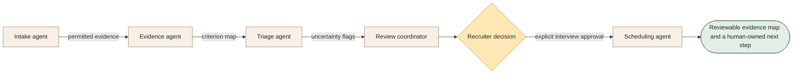

[← All 14 workflows](README.md) · [Guide](../../README.md) · [VYR source](https://vyrwork.com/agent-os/recruitment-flow)

# 09. Recruitment Screening

**BUILT FOR YOU · Checked 27 September 2026**

Build-to-order evidence triage; recruiters own progression, interview and rejection decisions.

> **Goal:** Prepare a transparent application review and coordinate recruiter-approved interviews.

The role design, worked example and evaluation below are educational proposals. The status and workflow boundary come from the linked VYR page; these role names are not a claim about its exact deployed agent roster.

## Trigger and collaboration

A candidate submits an application against written role criteria.

Evidence mapping preserves what the applicant actually provided. Triage describes gaps rather than inventing qualifications. The recruiter decides; scheduling receives only approved next steps.

## What each agent passes forward

| Role | Receives | Produces |
|---|---|---|
| Intake agent | Submitted application + approved criteria | Application record and permitted assessment fields |
| Evidence agent | Application record | Criterion-by-criterion evidence map |
| Triage agent | Evidence map | Review summary, uncertainty and near-match flags |
| Review coordinator | Summary + original evidence | Recruiter decision packet |
| Scheduling agent | Explicit interview approval + calendars | Agreed interview and coordination record |

**Human decision:** A recruiter or hiring manager owns every shortlist, interview, rejection and override.

**Boundary:** Do not infer protected characteristics or make autonomous employment decisions.

**Done means:** Reviewable evidence map and a human-owned next step.

## Worked example

Fictional run: an applicant demonstrates the core skill but lists no relevant certification. The evidence map labels that criterion 'not supplied'. The recruiter decides whether to request clarification or approve an interview.

This is a fictional scenario, not a customer result or a performance claim.

## How to evaluate it

Audit evidence traceability, missing-data treatment, reviewer overrides and unauthorised-decision attempts.

Keep a run ID, dated source references, permitted actions, current state, unresolved questions and decision owner with every handoff. Confirm external writes from the receiving system before declaring them complete. See the [build playbook](BUILD_PLAYBOOK.md) for implementation and model-role guidance.

## Artwork

The [image prompt set](IMAGE_PROMPTS.md) includes a dedicated illustration for this workflow. Generation provenance and current asset availability are tracked in [ARTWORK.md](ARTWORK.md).
