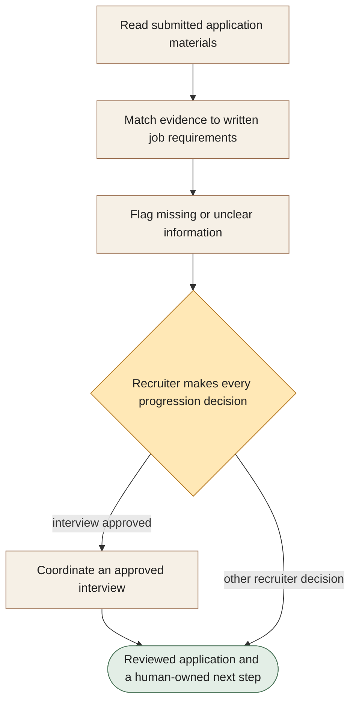

[← All workflows](README.md) · [VYR Agent OS](../../README.md)

# Recruitment Screening

## Help recruiters find the relevant facts in every application

A proposed service that organises applicant information against your written job requirements and prepares it for a recruiter’s review.

**The business benefit:** Aim to reduce the time spent finding and reformatting application details so recruiters can focus on the hiring decision.

**Worth discussing if...** your team reviews applications repeatedly and needs a consistent way to see what candidates have actually supplied.

**[Discuss simpler application review →](https://vyrwork.com/contact?utm_source=github&utm_medium=referral&utm_campaign=agent_os_workflows&utm_content=recruitment-screening_top)** · [WhatsApp VYR](https://wa.me/6598176520?text=Hi%20VYR%2C%20I%20found%20your%20Recruitment%20Screening%20example%20on%20GitHub.%20My%20business%3A%20__.%20Tasks%20per%20month%3A%20__.%20Software%20we%20use%3A%20__.%20I%20would%20like%20to%20discuss%20whether%20this%20could%20save%20us%20time%20or%20money.)

**Status: BUILT FOR YOU.** Custom application evidence review; recruiters own progression, interview and rejection decisions. Status checked 27 September 2026 against [VYR's workflow page](https://vyrwork.com/agent-os/recruitment-flow?utm_source=github&utm_medium=referral&utm_campaign=agent_os_workflows&utm_content=recruitment-screening_source).

## What your team would get

An application summary with supporting evidence, missing information and the recruiter’s approved next step.

## How the assistants work together

AI agents are software assistants with different jobs. One assistant reads the submitted material. Another matches it to the written requirements and a checker marks missing or unclear evidence. The recruiter decides what happens next; a scheduling assistant receives only approved interview requests.

This diagram explains the service in simple steps; it is not a screenshot or an exact system design.

**Your team stays in control:** A recruiter or hiring manager owns every shortlist, interview, rejection and override.

**What to know:** The service would not infer protected characteristics or make employment decisions on its own.

**[Explore clearer candidate summaries for recruiters →](https://vyrwork.com/contact?utm_source=github&utm_medium=referral&utm_campaign=agent_os_workflows&utm_content=recruitment-screening_flow)**

## Picture it in your business

Illustrative scenario: An applicant shows the required skill but has not supplied a relevant certificate. The summary marks the certificate as “not supplied”. The recruiter decides whether to ask for clarification or approve an interview.

This example is fictional, not a client result or a measured saving.

## What we would discuss

Your written job requirements, application materials, recruitment software and recruiter approval process.

You do not need a technical brief. Describe the task in your own words; VYR assesses the software connections, work involved and decisions that stay with your team before confirming a written scope and price.

## Could it be worth the investment?

Start with how often this task happens and how long it takes today. Subtract the checking your team still needs to do. Time saved may reduce paid overtime or avoid a future hire; it becomes a cash saving only when a paid cost is actually avoided. [See the worked savings and payback examples](../../ROI.md).

**[Talk through your recruitment administration →](https://vyrwork.com/contact?utm_source=github&utm_medium=referral&utm_campaign=agent_os_workflows&utm_content=recruitment-screening_bottom)** · [Send your brief on WhatsApp](https://wa.me/6598176520?text=Hi%20VYR%2C%20I%20found%20your%20Recruitment%20Screening%20example%20on%20GitHub.%20My%20business%3A%20__.%20Tasks%20per%20month%3A%20__.%20Software%20we%20use%3A%20__.%20I%20would%20like%20to%20discuss%20whether%20this%20could%20save%20us%20time%20or%20money.)

The WhatsApp draft asks for your business, approximate tasks per month and software. Rough figures are enough to start a conversation.

[Packages and pricing](https://vyrwork.com/pricing?utm_source=github&utm_medium=referral&utm_campaign=agent_os_workflows&utm_content=recruitment-screening_pricing) · [What happens after an enquiry](../../BUYERS_GUIDE.md) · [Explore all 14 workflows](README.md) · [Meet Dexter Ng](../../MEET_DEXTER.md)
