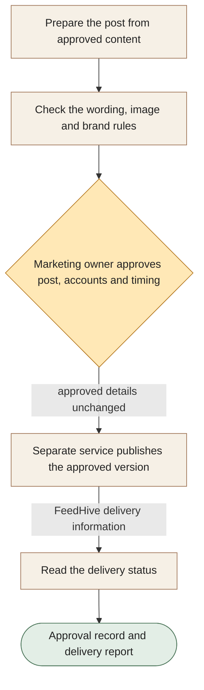

[← All workflows](README.md) · [VYR Agent OS](../../README.md)

# Social Command Center

## Know what was approved and what actually went live

See how VYR separates a read-only view of social delivery from the service that publishes posts after approval.

**The business benefit:** Explore a clearer way for your team to check approvals and delivery without confusing a prepared post with a published one.

**Worth discussing if...** several people prepare or review social posts, and checking the final version and delivery takes repeated coordination.

**[Discuss clearer social approvals and reporting →](https://vyrwork.com/contact?utm_source=github&utm_medium=referral&utm_campaign=agent_os_workflows&utm_content=social-command-center_top)** · [WhatsApp VYR](https://wa.me/6598176520?text=Hi%20VYR%2C%20I%20found%20your%20Social%20Command%20Center%20example%20on%20GitHub.%20My%20business%3A%20__.%20Tasks%20per%20month%3A%20__.%20Software%20we%20use%3A%20__.%20I%20would%20like%20to%20discuss%20whether%20this%20could%20save%20us%20time%20or%20money.)

**Status: LIVE.** VYR uses a read-only view of FeedHive delivery information; posting uses a separate service with human approval. Status checked 27 September 2026 against [VYR's workflow page](https://vyrwork.com/agent-os/social-media-flow?utm_source=github&utm_medium=referral&utm_campaign=agent_os_workflows&utm_content=social-command-center_source).

## What your team would get

A record of the approved post and a separate report showing its delivery status.

## How the assistants work together

AI agents are software assistants with different jobs. Writing and checking assistants prepare a post for your marketing owner. The owner approves all post details, including wording, image, accounts, labels and schedule. A separate publishing service confirms those details have not changed before posting. The command centre then reads the delivery status.

This diagram explains the service in simple steps; it is not a screenshot or an exact system design.

**Your team stays in control:** A named person approves the exact post, accounts and timing. Changing any approved field requires a fresh approval.

**What to know:** The command centre itself is read-only: it cannot create, approve, edit, schedule or delete posts. Publishing uses a separate service.

**[Explore a clearer approved-to-published process →](https://vyrwork.com/contact?utm_source=github&utm_medium=referral&utm_campaign=agent_os_workflows&utm_content=social-command-center_flow)**

## Picture it in your business

Illustrative scenario: A reviewer approves a Tuesday post for one account. Someone then changes the image, so publication is held for another review. After approval, the separate publisher releases the post and the command centre reports its delivery status.

This example is fictional, not a client result or a measured saving.

## What we would discuss

Your social accounts, person responsible for approvals, content sources and publishing software.

You do not need a technical brief. Describe the task in your own words; VYR assesses the software connections, work involved and decisions that stay with your team before confirming a written scope and price.

## Could it be worth the investment?

Start with how often this task happens and how long it takes today. Subtract the checking your team still needs to do. Time saved may reduce paid overtime or avoid a future hire; it becomes a cash saving only when a paid cost is actually avoided. [See the worked savings and payback examples](../../ROI.md).

**[Talk through how your team reviews social posts →](https://vyrwork.com/contact?utm_source=github&utm_medium=referral&utm_campaign=agent_os_workflows&utm_content=social-command-center_bottom)** · [Send your brief on WhatsApp](https://wa.me/6598176520?text=Hi%20VYR%2C%20I%20found%20your%20Social%20Command%20Center%20example%20on%20GitHub.%20My%20business%3A%20__.%20Tasks%20per%20month%3A%20__.%20Software%20we%20use%3A%20__.%20I%20would%20like%20to%20discuss%20whether%20this%20could%20save%20us%20time%20or%20money.)

The WhatsApp draft asks for your business, approximate tasks per month and software. Rough figures are enough to start a conversation.

[Packages and pricing](https://vyrwork.com/pricing?utm_source=github&utm_medium=referral&utm_campaign=agent_os_workflows&utm_content=social-command-center_pricing) · [What happens after an enquiry](../../BUYERS_GUIDE.md) · [Explore all 14 workflows](README.md) · [Meet Dexter Ng](../../MEET_DEXTER.md)
