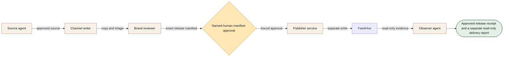

[← All workflows](README.md) · [VYR Agent OS](../../README.md)

# Social Command Center

## When social reporting and release decisions are scattered

For teams that need visibility into delivery and control over exactly what gets released. Separate the view of campaign evidence from the authority to publish.

**[Discuss social approvals with VYR →](https://vyrwork.com/contact?utm_source=github&utm_medium=referral&utm_campaign=agent_os_workflows&utm_content=social-command-center_top)**

**Status: LIVE.** Live FeedHive telemetry is read-only; new writes use a separate approval-bound publisher. Status checked 27 September 2026 against [VYR's workflow page](https://vyrwork.com/agent-os/social-media-flow?utm_source=github&utm_medium=referral&utm_campaign=agent_os_workflows&utm_content=social-command-center_source).

## What the workflow would help you achieve

Turn approved content into a controlled release and observe its actual delivery.

## How the work moves

Drafting and review prepare the release packet. A person approves the exact copy, image, accounts, labels and schedule. A separate publisher validates that binding; the observer only reads resulting telemetry.

This is a simplified service illustration. It is not a screenshot or a claim about the exact deployed agent roster.

**Your team stays in control:** Named-human approval binds the exact release manifest. Any changed field invalidates release.

**Scope boundary:** The command center itself cannot create, approve, edit, schedule or delete posts.

## A conversation starter

Illustrative scenario: a reviewer approves Tuesday copy for one account. A later image swap makes the binding invalid, so the publisher holds. After a fresh approval, a release can proceed; the observer reports the returned delivery state without mutating it.

This example is fictional; it is not a customer result or a promise of measured savings.

## What VYR would scope with you

Your accounts, approval owner, content sources and current publishing tools.

VYR reviews the current steps, the integration access available, the human decisions and an observable completion condition. Compatibility, timing and final deliverables are confirmed in the written scope.

## Take the next step

**[Discuss social approvals with VYR →](https://vyrwork.com/contact?utm_source=github&utm_medium=referral&utm_campaign=agent_os_workflows&utm_content=social-command-center_bottom)**

Prefer a short conversation? [WhatsApp VYR](https://wa.me/6598176520?text=Hi%20VYR%2C%20I%20found%20your%20Social%20Command%20Center%20workflow%20on%20GitHub.%20I%20would%20like%20to%20discuss%20automating%20a%20business%20process.). Tell us which process takes time, the systems involved and the exception your team most often has to resolve.

[Packages and pricing](https://vyrwork.com/pricing?utm_source=github&utm_medium=referral&utm_campaign=agent_os_workflows&utm_content=social-command-center_pricing) · [What happens after an enquiry](../../BUYERS_GUIDE.md) · [Explore all 14 workflows](README.md)
