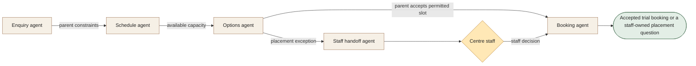

[← All workflows](README.md) · [VYR Agent OS](../../README.md)

# Tuition Trial Booking

## When trial-class enquiries create repeated back-and-forth

For centres managing parent enquiries across levels, subjects, locations and class capacity. Offer valid trial options while staff retain placement and child-specific decisions.

**[Discuss trial-class bookings with VYR →](https://vyrwork.com/contact?utm_source=github&utm_medium=referral&utm_campaign=agent_os_workflows&utm_content=tuition-centres_top)**

**Status: BUILT FOR YOU.** Build-to-order enquiry and trial-class booking workflow; placement stays with centre staff. Status checked 27 September 2026 against [VYR's workflow page](https://vyrwork.com/agent-os/tuition-flow?utm_source=github&utm_medium=referral&utm_campaign=agent_os_workflows&utm_content=tuition-centres_source).

## What the workflow would help you achieve

Match a parent's enquiry to a genuinely available trial class.

## How the work moves

Schedule supplies actual capacity to options. The parent chooses a valid slot. Placement or special-arrangement questions branch to staff; booking records only the accepted, permitted outcome.

This is a simplified service illustration. It is not a screenshot or a claim about the exact deployed agent roster.

**Your team stays in control:** Centre staff own placement, assessments, special arrangements, fee exceptions and progress discussions.

**Scope boundary:** No assessment of a child's ability or invented class capacity.

## A conversation starter

Illustrative scenario: a parent wants a weekday maths trial near home. Two valid classes are offered. A request to move the child to a higher level pauses that decision for centre staff before the booking is finalised.

This example is fictional; it is not a customer result or a promise of measured savings.

## What VYR would scope with you

Your class timetable, capacity source, enquiry channels and staff handoff rules.

VYR reviews the current steps, the integration access available, the human decisions and an observable completion condition. Compatibility, timing and final deliverables are confirmed in the written scope.

## Consider the business case

Estimate the time this process consumes, the review that would remain, and whether freed capacity would avoid a paid cost. [See the ROI and staffing-capacity examples](../../ROI.md).

## Take the next step

**[Discuss trial-class bookings with VYR →](https://vyrwork.com/contact?utm_source=github&utm_medium=referral&utm_campaign=agent_os_workflows&utm_content=tuition-centres_bottom)**

Prefer a short conversation? [WhatsApp VYR](https://wa.me/6598176520?text=Hi%20VYR%2C%20I%20found%20your%20Tuition%20Trial%20Booking%20workflow%20on%20GitHub.%20I%20would%20like%20to%20discuss%20automating%20a%20business%20process.). Tell us which process takes time, the systems involved and the exception your team most often has to resolve.

[Packages and pricing](https://vyrwork.com/pricing?utm_source=github&utm_medium=referral&utm_campaign=agent_os_workflows&utm_content=tuition-centres_pricing) · [What happens after an enquiry](../../BUYERS_GUIDE.md) · [Explore all 14 workflows](README.md)
