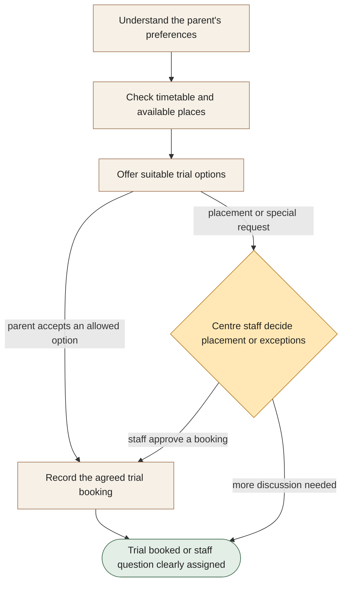

[← All workflows](README.md) · [VYR Agent OS](../../README.md)

# Tuition Trial Booking

## Make it easier for parents to find a suitable trial class

A proposed service that brings the parent’s preferred subject, level, location and times together with your actual class availability.

**The business benefit:** Aim to reduce repeated timetable questions and booking messages, giving centre staff more time for parents who need personal advice.

**Worth discussing if...** staff regularly move between parent messages and class timetables to arrange trial lessons.

**[Discuss easier trial-class bookings →](https://vyrwork.com/contact?utm_source=github&utm_medium=referral&utm_campaign=agent_os_workflows&utm_content=tuition-centres_top)** · [WhatsApp VYR](https://wa.me/6598176520?text=Hi%20VYR%2C%20I%20found%20your%20Tuition%20Trial%20Booking%20example%20on%20GitHub.%20My%20business%3A%20__.%20Tasks%20per%20month%3A%20__.%20Software%20we%20use%3A%20__.%20I%20would%20like%20to%20discuss%20whether%20this%20could%20save%20us%20time%20or%20money.)

**Status: BUILT FOR YOU.** Build-to-order enquiry and trial-class booking workflow; placement stays with centre staff. Status checked 27 September 2026 against [VYR's workflow page](https://vyrwork.com/agent-os/tuition-flow?utm_source=github&utm_medium=referral&utm_campaign=agent_os_workflows&utm_content=tuition-centres_source).

## What your team would get

An accepted trial booking in an available class, or a clearly explained question for centre staff to resolve.

## How the assistants work together

AI agents are software assistants with different jobs. An enquiry assistant gathers the parent’s preferences. A timetable assistant checks places and another presents suitable options. Staff handle placement or special requests before the booking assistant records the agreed trial.

This diagram explains the service in simple steps; it is not a screenshot or an exact system design.

**Your team stays in control:** Centre staff decide placement, assessments, special arrangements, fee exceptions and discussions about a child’s progress.

**What to know:** The assistant would not assess a child’s ability or invent an available class place.

**[Explore fewer timetable messages for your staff →](https://vyrwork.com/contact?utm_source=github&utm_medium=referral&utm_campaign=agent_os_workflows&utm_content=tuition-centres_flow)**

## Picture it in your business

Illustrative scenario: A parent wants a weekday maths trial near home. Two available classes are offered. A request for a higher class level goes to centre staff before a booking is finalised.

This example is fictional, not a client result or a measured saving.

## What we would discuss

Your class timetable, available-place records, enquiry channels and the questions staff must decide.

You do not need a technical brief. Describe the task in your own words; VYR assesses the software connections, work involved and decisions that stay with your team before confirming a written scope and price.

## Could it be worth the investment?

Start with how often this task happens and how long it takes today. Subtract the checking your team still needs to do. Time saved may reduce paid overtime or avoid a future hire; it becomes a cash saving only when a paid cost is actually avoided. [See the worked savings and payback examples](../../ROI.md).

**[Talk through your centre’s parent enquiries →](https://vyrwork.com/contact?utm_source=github&utm_medium=referral&utm_campaign=agent_os_workflows&utm_content=tuition-centres_bottom)** · [Send your brief on WhatsApp](https://wa.me/6598176520?text=Hi%20VYR%2C%20I%20found%20your%20Tuition%20Trial%20Booking%20example%20on%20GitHub.%20My%20business%3A%20__.%20Tasks%20per%20month%3A%20__.%20Software%20we%20use%3A%20__.%20I%20would%20like%20to%20discuss%20whether%20this%20could%20save%20us%20time%20or%20money.)

The WhatsApp draft asks for your business, approximate tasks per month and software. Rough figures are enough to start a conversation.

[Packages and pricing](https://vyrwork.com/pricing?utm_source=github&utm_medium=referral&utm_campaign=agent_os_workflows&utm_content=tuition-centres_pricing) · [What happens after an enquiry](../../BUYERS_GUIDE.md) · [Explore all 14 workflows](README.md) · [Meet Dexter Ng](../../MEET_DEXTER.md)
